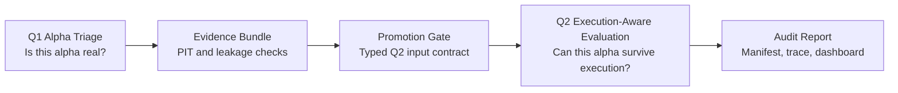

# PortfolioOS

PortfolioOS is an audit-ready ML/quant decision evaluation platform with
portfolio rebalance, scenario, approval, execution-simulation, TCA, and
research CLI components. It turns risky research artifacts into typed,
reproducible, execution-aware evaluation records.

This MVP is an auxiliary decision-support tool only. It does not constitute investment advice.

## Problem

ML/quant research workflows often fail silently through point-in-time mistakes,
forward-return leakage, unrealistic execution assumptions, non-reproducible
scripts, or hidden handoffs from research to portfolio construction. A single
backtest score is not enough to decide whether a signal should move forward.

## Solution

PortfolioOS packages the workflow as a contract-first evaluation system:

- Q1 asks: "Is this alpha real?"
- Q2 asks: "Can this alpha survive execution?"
- Evidence bundles, promotion gates, provenance manifests, structured traces,
  and audit reports keep those questions separate and reproducible.

The research surface is now split into two tracks:

- **Track A: Single-Alpha Research Factory** for SUE, revision-confirmed
  earnings, Factor Discovery candidate design, and other individual
  factor/event candidates.
- **Track B: Multi-Factor Portfolio Validation Engine** for formal
  factor/component pools, risk attribution, ensemble OOS, ablation, and
  portfolio assembly diagnostics.

Both tracks share the same PortfolioOS governance platform, but neither can
enter Q2 directly or claim production approval. The machine-readable boundary
registry is `configs/research_tracks.yaml`; the architecture note is
`docs/architecture/two_track_research_architecture.md`.

The project is not an autonomous trading bot and does not claim alpha quality.
It is a local, audit-oriented platform for evaluating whether a candidate is
safe enough to study further.

## Architecture



Key boundaries:

- Q1 validates schemas, timestamps, leakage risk, and planned tests.
- Promotion Gate can allow a plain Q2 input contract, but it does not run Q2.
- Q2 reports unavailable layers honestly when PortfolioOS hooks are missing.
- Audit artifacts record what happened without fabricating results.

## Quickstart

```bash
poetry install
make demo
make demo-v2
make portfolio-quant-walk-forward
make validate
```

`make demo` writes ignored local artifacts under `outputs/demo/`. `make
demo-v2` writes the typed AlphaView demo under `outputs/demo_v2/`. `make
validate` runs the local validation target with no-network guard, example
validation, report generation, focused regression tests, and audit report tests.

`make portfolio-quant-walk-forward` writes the PortfolioOS portfolio-quant
walk-forward smoke artifacts under `outputs/portfolio_quant_walk_forward/`.
It runs a no-lookahead monthly historical rebalance evaluation with equal-weight,
mean-variance, risk-parity, cost-unaware, and PortfolioOS cost-aware baselines,
then exports NAV, drawdown, turnover, CVaR, exposure-drift, strategy-comparison,
policy-gate, and markdown report artifacts. This is a portfolio construction /
execution-aware evaluation surface only; it is not new alpha research, Q1/Q2
entry, paper/live trading, broker/order workflow, or production approval.

## Example Outputs

`outputs/demo/` contains:

- `q1_summary.json`
- `evidence_bundle.json`
- `promotion_decision.json`
- `q2_execution_matrix.csv`
- `cost_sensitivity.csv`
- `audit_report.md`
- `run_manifest.json`
- `trace.jsonl`
- `dashboard.html`

These artifacts are generated locally and ignored by git.

`outputs/demo_v2/` contains the typed-alpha release-candidate surface:

- `typed_alpha_release_manifest.json`
- `us_sue_event_alpha_view.json`
- `us_sue_event_evidence_bundle.json`
- `us_sue_projection_manifest.json`
- `us_sue_projection_panel.csv`
- `us_sue_projection_diagnostics.json`
- `us_sue_abstain_report.json`
- `us_sue_promotion_decision_v2.json`
- `us_sue_q2_matrix.csv`
- `us_sue_audit_report.md`
- `paper_overlay_calibration_summary.json`
- `paper_overlay_readiness.md`
- `dashboard_v2.html`

The demo-v2 release manifest records local-only status, schema versions, the
typed-alpha chain, and explicit non-approval flags.
The demo-v2 dashboard includes a first-screen status summary, typed-alpha chain,
artifact links, manifest summary, unavailable-artifact handling, and safety
boundaries while remaining static and read-only.

`reports/typed_alpha_closeout_report.md` is the deterministic closeout memo for
Phase 35-42 plus release hardening. It states what the typed-alpha chain proves,
what it does not prove, known limitations, and allowed next work.

`make typed-q2-adapter-fixture` writes the local Phase 47 adapter artifacts under
`outputs/typed_q2_adapter_fixture/`. This opt-in smoke path connects the typed
Q2 input contract and expected-return panel to existing local PortfolioOS fixture
period-attribution outputs where stable mappings exist. Unsupported layers stay
explicitly unavailable, and the artifacts keep no-live, no-order, and no-broker
confirmations.

`make typed-expected-return-injection-fixture` writes the local Phase 48
injection artifacts under `outputs/typed_expected_return_injection_fixture/`.
This opt-in smoke path validates the typed Q2 input contract and projection
manifest, then writes `optimizer_input_snapshot.csv` proving the projected
expected-return values reached the local optimizer input shape. It is not an
optimizer response proof, alpha success claim, or production approval.

`make typed-optimizer-response-acceptance` writes the local Phase 49 optimizer
response artifacts under `outputs/typed_optimizer_response_acceptance/`. This
opt-in smoke path evaluates deterministic positive, scaled, sign-flipped, zero,
and explicit-abstain typed expected-return panels against the local optimizer
fixture. It reports aggregate response diagnostics only; it does not write
orders, broker payloads, live performance, or production approval.

`make sue-typed-q2-survival` writes the local Phase 50 SUE survival artifacts
under `outputs/sue_typed_q2_survival/`. This opt-in smoke path aligns the SUE
typed projection to the local optimizer fixture date, proves the SUE
expected-return values reached `optimizer_input_snapshot.csv`, and maps Q2 rows
as observed where stable local fixture hooks exist, including the
`risk_controlled` layer through the `naive_pro_rata` adapter. SUE remains an
integration benchmark and Q2 candidate only, not production approval.

`make sue-survival-attribution` rebuilds the local Phase 50 SUE survival
fixture and writes Phase 51 attribution artifacts:
`outputs/sue_typed_q2_survival/failure_attribution.json` and
`reports/sue_typed_q2_survival_attribution.md`. The report distinguishes alpha
failure from execution failure, projection sparsity from optimizer response, and
states whether revision marginal-value testing should proceed.

`make sue-expanded-typed-q2-survival` writes the local Phase 56A expanded SUE
candidate artifacts under `outputs/sue_expanded_typed_q2_survival/` and
`reports/sue_expanded_typed_q2_survival_report.md`. The closeout note lives at
`reports/sue_expanded_typed_q2_closeout.md`. This deterministic fixture expands
SUE breadth to 120 event-name rows across 12 rebalance dates while preserving
PIT timestamps, explicit abstain semantics, and no-live/no-order boundaries. It
is an expanded typed-Q2 candidate benchmark, not real historical evidence,
paper readiness, or production approval.

`make sue-historical-event-panel-smoke` writes the Reopen-H1A WRDS PIT-labeled
SUE event panel smoke artifacts under `outputs/sue_historical_event_panel/` and
`reports/sue_historical_event_panel_report.md`. The builder records IBES/CRSP
source lineage, PIT visibility checks, security-linkage coverage, explicit
diagnostic-only rows, and missing estimate/actual/price coverage loss. It does
not prove SUE alpha success, approve paper/live trading, create broker/order
paths, or promote anything into Alpha Registry.

`make sue-historical-event-panel-full-audit` reads
`configs/wrds_sue_event_panel_full.yaml` and attempts the Reopen-H1A.1 local
WRDS full-mode path. If the configured IBES/CRSP extracts are missing, it writes
`outputs/sue_historical_event_panel_full/missing_inputs_report.json` and
`reports/sue_historical_event_panel_full_report.md` without creating a fake
historical panel or falling back to smoke data. With local extracts present, the
same full-mode builder writes the PIT-labeled panel artifacts under
`outputs/sue_historical_event_panel_full/`.

`make sue-historical-crsp-price-extract` runs the Reopen-H1A.2 resumable CRSP
daily price cache expansion from local SUE link extracts. It writes chunked
ignored cache files under `data/cache/wrds_sue_event_panel/crsp_daily_chunks/`,
merges `data/cache/wrds_sue_event_panel/crsp_daily.csv`, and records
`outputs/sue_historical_event_panel_full/crsp_price_extract_manifest.json`.
It is a data-coverage step only, not event evidence, Q2 evaluation, paper
readiness, or production approval.

`make sue-historical-linkage-rescue` runs an exact-CUSIP CRSP stocknames rescue
against the expanded SUE linkage failures. It writes the rescued local link
cache to `data/cache/wrds_sue_event_panel/ibes_links_rescued.csv` plus
`outputs/sue_coverage_linkage_price_diagnostics/linkage_rescue_report.json`.
It does not use ticker-only matching, run Q2, approve paper/live trading, or
promote Alpha Registry state.

`make sue-historical-event-panel-expanded` runs Reopen-H1C. It can refresh
expanded WRDS `statsum`-derived actual/estimate inputs into ignored local cache,
then writes expanded SUE panel artifacts, coverage rescue diagnostics, linkage
failures, missing price report, PIT visibility, and
`reports/sue_historical_event_panel_expansion_report.md`. It is coverage rescue
and historical evidence preparation only, not Q2, optimizer-path evaluation,
paper readiness, or production approval.

`make sue-historical-event-evidence-grid` runs the historical SUE event evidence
grid. After H1C, the default config points at the expanded WRDS/PIT-safe SUE
sample. It writes event-window grid, rank IC by date,
top-bottom spread by date, placebo diagnostics, coverage by month/year,
PIT/leakage audit, and a bounded evidence report under
`outputs/sue_historical_event_evidence/` and
`reports/sue_historical_event_evidence_report.md`. It evaluates event-window
evidence only; it does not run Q2, optimizer-path evaluation, paper workflows,
broker/order paths, or production approval.

`make sue-coverage-linkage-price-diagnostics` runs the post-H1C coverage,
linkage, and price-window diagnostic pass. It reads the expanded SUE panel
artifacts and CRSP cache, then writes coverage loss waterfall, linkage loss,
price cache gap, diagnostic summary, and
`reports/sue_coverage_linkage_price_diagnostics_report.md`. It is a data
diagnostic only; it does not run Q2, optimizer-path evaluation, Alpha Registry
promotion, broker/order workflows, paper trading, or production approval.

`make sue-score-definition-diagnostics` runs Reopen-H1D. It compares raw EPS
difference against scale-aware SUE score definitions on the expanded WRDS/PIT
event panel, including expected-EPS, actual-EPS, winsorized, and price-scaled
variants. It writes `outputs/sue_score_definition_diagnostics/` plus
`reports/sue_score_definition_diagnostics_report.md`. This explains why Rank IC
can be positive while raw-tail top-bottom spread is negative; it is score
definition diagnosis only and does not run Q2, optimizer-path evaluation, paper
workflows, or production approval.

`make sue-score-definition-gate` runs Reopen-H1E. It preregisters SUE score
definitions, downgrades raw EPS difference to diagnostic-only, applies
denominator and winsorization guards, runs event-window/placebo/tail/coverage
diagnostics, and writes `outputs/sue_score_definition_gate/` plus
`reports/sue_score_definition_gate_report.md`. Scale-aware SUE remains a
candidate only; this target does not run Q2, optimizer-path evaluation, Alpha
Registry promotion, paper workflows, live trading, broker/order paths, or
production approval.

`make sue-placebo-failure-attribution` runs Reopen-H1E.1. It diagnoses why the
event-date-shift placebo can dominate the provisional scale-aware SUE read,
including timing shifts, return-window overlap, market/regime concentration,
denominator/tail buckets, and unavailable sector/size/liquidity hooks. It writes
`outputs/sue_placebo_failure_attribution/` plus
`reports/sue_placebo_failure_attribution_report.md`. This diagnostic does not
select a score, run Q2, run optimizer-path evaluation, promote Alpha Registry
state, create paper/live/broker/order workflows, or approve production use.

`make sue-regime-filter-placebo-check` runs Reopen-H1E.2. It validates the
H1E.1 market-regime attribution by rerunning filtered score-gate summaries and
placebo curves after excluding March 2020, high-volatility weeks, and
low-liquidity weeks. It writes `outputs/sue_regime_filter_placebo_check/` plus
`reports/sue_regime_filter_placebo_check_report.md`. This diagnostic does not
select a score, run Q2, run optimizer-path evaluation, promote Alpha Registry
state, create paper/live/broker/order workflows, or approve production use.

`make sue-event-timing-anchor-audit` runs Reopen-H1E.3. It audits whether the
SUE event anchor is too late by comparing current tradable, announcement-date,
and shifted anchors, plus pre-event drift windows. It writes
`outputs/sue_event_timing_anchor_audit/` plus
`reports/sue_event_timing_anchor_audit_report.md`. This diagnostic does not
select a score, run Q2, run optimizer-path evaluation, promote Alpha Registry
state, create paper/live/broker/order workflows, or approve production use. The
current run returns `anchor_definition_likely_late`: `shift_minus_5_td` is the
strongest `[+2,+22]` anchor and `minus_5_minus_1` is the strongest pre-event
drift window, so SUE remains blocked before typed projection/Q2 until the anchor
policy is explained or corrected and H1E is rerun.

`make sue-announcement-timestamp-policy-audit` runs Reopen-H1E.4. It audits
whether an earlier SUE tradable anchor is backed by an auditable actual-EPS
availability timestamp source, rather than by the stronger -5/-10 shifted
placebo windows alone. It writes
`outputs/sue_announcement_timestamp_policy/` plus
`reports/sue_announcement_timestamp_policy_report.md`. This diagnostic does
not select a score, run Q2, run optimizer-path evaluation, promote Alpha
Registry state, create paper/live/broker/order workflows, or approve production
use. The current expanded-panel run finds `auditable_source_event_count=0` and
`repaired_event_count=0`, so SUE remains blocked before anchor repair, H1E
rerun, typed projection, or Q2 work.

`make sue-timestamp-source-extract` pulls local WRDS timestamp-source cache files
for Reopen-H1E.5 from IBES actuals and Compustat quarterly data. It writes
ignored local cache files under `data/cache/wrds_sue_timestamp_sources/` plus a
source manifest under `outputs/sue_timestamp_enrichment/`. The current WRDS run
matched IBES actual timestamps for `17,027` events and Compustat RDQ for
`12,987` events.

`make sue-timestamp-enrichment` runs Reopen-H1E.5. It enriches SUE events with
local timestamp sources such as IBES `anndats_act`, Compustat `rdq`, exact
earnings-release timestamps, and SEC filing timestamps. It writes
`outputs/sue_timestamp_enrichment/` plus
`reports/sue_timestamp_enrichment_report.md`. Date-only sources are recorded as
audit evidence but do not become tradable timestamps. Exact release timestamps
can create repair candidates for later review, but this phase does not rerun
H1E, select a score, run Q2, run optimizer-path evaluation, promote Alpha
Registry state, create paper/live/broker/order workflows, or approve production
use. The current enriched WRDS run returns
`timestamp_enrichment_no_repair_sue_blocked` with `repairable_event_count=0`,
`ibes_anndats_act_count=17027`, and `compustat_rdq_count=12987`.

`make revision-marginal-value-gate` writes the local Phase 52 revision
marginal-value artifacts under `outputs/revision_marginal_value_gate/` and
`reports/revision_marginal_value_report.md`. The gate requires WRDS as the
PIT-safe analyst revision source, rejects FMP frozen estimate history, rejects
raw tree or feature importance as proof, and decides whether revision should
advance to composite evaluation. The default fixture archives revision as a real
shadow branch without composite promotion or production approval.

`make alpha-registry-v2` writes the local Phase 55 alpha registry under
`outputs/alpha_registry_v2/` and `reports/alpha_registry_report.md`. The
registry freezes SUE, revision, composite, old alpha package, Qlib revision,
residual momentum, A-share, and leakage-fixture decision states with explicit
typed-chain stop layers. It does not open research, broker, order, paper canary,
or production-approval paths.

`docs/releases/portfolioos_v1_research_audit_release.md` packages the Phase 65
research-audit release hygiene surface after Phase 56A closeout. It summarizes
the Q1 boundary, Evidence Bundle / Promotion Gate boundary, Typed AlphaView
contract, SUE local and expanded typed-Q2 benchmark status, Alpha Registry v2,
and dashboard/audit/provenance/no-network safeguards. It explicitly records no
production approval, no live trading, no broker/order path, and no paper-ready
alpha claim.

`make factor-discovery-teaching-baseline` writes the local FD-1 Factor Discovery
Sandbox teaching-mode artifacts under `outputs/factor_discovery/teaching_mode/`.
The baseline uses a deterministic current-constituent style fixture, QQQ
benchmark reporting, 29 price-volume factor columns, IC/ICIR tables,
correlation matrix, ICIR weights, and a markdown report. It is explicitly
survivorship-biased, educational-only, and not alpha evidence.

`make factor-discovery-design-layer` writes the FD-D0 Factor Design Layer
contract under `outputs/factor_discovery/design_layer/` plus
`reports/factor_discovery_design_layer_report.md`. The design layer requires
every future candidate to state the market pain point, mechanism hypothesis,
investor constraint or behavior, expected universe/regime, why the pattern
should not be arbitraged away, observable pre-formula diagnostics, placebo
design, cost/capacity risks, and expected failure modes before formula
validation. The operating rule is that formula is measurement, not thesis.
Standalone candidate-family runners now write a `candidate_design_manifest.json`
before validation; missing or invalid design contracts block candidate
validation. `make factor-discovery-fd-wide-design-audit` scans existing FD
candidate output directories and reports any candidate or family decision
artifact that lacks a valid same-directory design manifest.

`make factor-discovery-design-d1` writes the FD-D1 market pain-point map under
`outputs/factor_discovery/design_layer/d1/`. It creates
`factor_pain_point_map.md`, `factor_design_ledger.csv`,
`candidate_family_backlog.json`, and `factor_design_d1_summary.json`. FD-D1
reframes existing candidate diagnostics, including momentum low-vol,
small-cap quality residual momentum, revision-confirmed earnings
underreaction, and SUE event timing, as prior diagnostic history under a
mechanism-first ledger. It does not run validation, claim alpha evidence,
enter Q1/Q2, update Alpha Registry, or approve production use.

`make factor-discovery-design-d2` writes FD-D2 pre-formula diagnostics under
`outputs/factor_discovery/design_layer/d2/`. It reads the FD-D1 design ledger
and writes `pre_formula_diagnostics.csv`,
`candidate_family_d2_decisions.json`,
`pre_formula_diagnostic_summary.json`, and
`pre_formula_diagnostic_report.md`. FD-D2 checks coverage, PIT/timestamp
readiness, placebo design, exposure-contamination risk, and cost/capacity
before any formula validation. The current run keeps all formula validation
blocked and marks only `sector_neutral_residual_momentum` as ready for a D3
charter. It is not alpha evidence and does not enter allocator, Q1/Q2, Alpha
Registry, broker/order/live, or production approval paths.

`make factor-discovery-insider-d2-observability` runs D2-INSIDER-01, a
no-formula observability fixture for the active
`insider_disclosure_regime_2023` pain-point group. It writes a deterministic
Form 4-like event registry, event subset counts, timestamp/tradability audits,
CAR-window diagnostics, matched controls, placebo diagnostics, subset-level D2
decisions, and a report under
`outputs/factor_discovery/insider_disclosure/d2/`. It does not write formula
scores or a MeasurementSpec, does not enter Q1/Q2, does not update the Alpha
Registry, and does not open optimizer, portfolio, paper, broker/order/live, or
production approval paths.

`make factor-discovery-insider-d2-real-observability` runs D2-INSIDER-01R, a
local Form 4 / 10b5-1 extraction and replay path. It reads only local SEC-style
ownership XML inputs from `data/cache/sec_form4_insider_disclosure/`, writes
source-admission, XML-parse, issuer-mapping, timestamp, market-join, and D2
replay artifacts under `outputs/factor_discovery/insider_disclosure/d2_real/`,
and fails gracefully with `missing_inputs_report.json` when the local archive is
absent. It uses no network fetch, writes no formula score or MeasurementSpec,
does not enter Q1/Q2, and does not update the Alpha Registry or open optimizer,
portfolio, paper, broker/order/live, or production approval paths.

`make factor-discovery-insider-d2-sell-contrast` runs D2-INSIDER-02, a
no-formula observability pass for the post-2023 planned-vs-discretionary S-code
sell contrast. It reuses the real Form 4 aggregate event registry and local
price panel, writes sell subset counts, plan-flag coverage, CAR diagnostics,
controls, placebos, and a D2 decision under
`outputs/factor_discovery/insider_disclosure/d2_sell_contrast/`. The current
real aggregate run is blocked before D3 because planned sells are not observable
in the parsed event stream (`planned_sell_event_count=0`) while unknown plan
flags remain large. It writes no MeasurementSpec, formula score,
expected-return panel, Q1/Q2 handoff, optimizer input, Alpha Registry update,
paper workflow, broker/order/live path, or production approval.

`make factor-discovery-insider-plan-flag-audit` runs D2-INSIDER-02A, a narrow
parser/source audit for the S-code sell plan-flag blocker. It samples post-2023
S-code filings, inventories raw fields containing 10b5/plan/adoption/checkbox
terms, checks footnote and explanation text, and distinguishes explicit false
from missing plan flags. The current local audit finds some structured checked
raw filings, but not enough clean plan-flag coverage to reopen D3; missing
flags remain unknown/no-view.

`make factor-discovery-insider-plan-flag-repair` runs D2-INSIDER-02B, the final
source/locator/parser repair gate for the planned-vs-discretionary sell
contrast. It audits accession-to-raw-XML resolution, structured 10b5-1 checkbox
parsing, explicit true/false/missing counts, and parser before/after
classification without writing formulas or downstream handoffs. The current run
fails the raw-source gate (`raw_file_found_share=0.002241`), finds only 25
repaired planned-sell events across 6 months, keeps D2-INSIDER-02 blocked, and
sets the next action to `switch_to_D2_8K_01_subtype_underreaction`.

`make factor-discovery-8k-d2-observability` runs D2-8K-01, a no-formula
observability fixture for 8-K subtype underreaction. It prioritizes auditor
change, CFO departure, CEO departure, material agreement termination, and
restatement/amendment-related 8-K rows, then writes subtype counts, timestamp
audit, coverage/no-view reports, CAR-window diagnostics, matched controls,
placebos, a D2 decision summary, and a report under
`outputs/factor_discovery/8k_subtype/d2/`. The default target uses a
deterministic fixture only; it is not real EDGAR evidence, writes no formula or
MeasurementSpec, does not enter Q1/Q2, does not update Alpha Registry, and does
not open optimizer, portfolio, paper, broker/order/live, or production approval
paths.

`make factor-discovery-8k-d2-real-observability` runs D2-8K-01R, a local-only
real EDGAR 8-K / 8-K/A source-admission and subtype replay path. It reads
`request_specs.json` plus cached documents where available, audits accession to
raw-document locator coverage, accepted timestamp coverage, document type,
item-header parsing, issuer/ticker/market join coverage, then replays the
D2-8K-01 no-formula CAR/control/placebo protocol. The current controlled local
archive run reads 2,000 indexed files from the repo-external SEC filing archive,
finds `raw_file_found_share=1.0`, `accepted_timestamp_coverage_share=1.0`,
`item_header_parse_coverage_share=0.439`, `market_coverage_share=0.0555`,
`priority_market_coverage_share=0.396396`, and returns
`blocked_market_coverage` with no D3 charter. The runner now filters and
combines five local price panels, including a bounded WRDS CRSP rescue cache
for 2022-2024 priority 8-K events. The current priority subtype coverage is
still below the real-D2 gate because many remaining events are in 2025/2026,
beyond the current workspace WRDS CRSP max date (`2024-12-31`). It writes no formula,
MeasurementSpec, expected-return panel, Q1/Q2 handoff, optimizer input, Alpha
Registry update, paper workflow, broker/order/live path, or production
approval.

`make factor-discovery-small-emotion-d2` runs D2-SMALL-EMOTION-01, a
no-formula small-cap shock-conditioned emotion / liquidity observability pass.
It reads the local PIT small-cap daily price-volume, IWM benchmark, and
delisting cache, builds investable small-cap shock subsets for panic
overreaction, FOMO continuation, and liquidity-vacuum reversal candidates, and
writes stale-price, ADV/capacity, cost/spread, delisting, CAR-window, matched
control, placebo, no-view, and D2 decision artifacts under
`outputs/factor_discovery/small_emotion/d2_observability/`. The default target
uses a controlled row cap for local smoke replay and records that cap in the
data coverage report. The current smoke returns `hold_insufficient_sample` and
opens no D3 charter. It writes no formula score, MeasurementSpec,
expected-return panel, Q1/Q2 handoff, optimizer input, Alpha Registry update,
paper workflow, broker/order/live path, or production approval.

`make factor-discovery-small-emotion-full-replay` runs D2-SMALL-EMOTION-01A,
a chunked/full replay over local WRDS small-cap price chunks with subset-level
guards. It writes per-chunk D2 artifacts plus `chunk_manifest.csv`,
`subset_guard_aggregate.csv`, `full_replay_decision.json`, and
`full_replay_report.md` under
`outputs/factor_discovery/small_emotion/d2_full_replay/`. Reruns are resumable
unless invoked with `--refresh`. This remains no-formula observability only and
does not write a MeasurementSpec, expected-return panel, Q1/Q2 handoff,
optimizer input, portfolio artifact, Alpha Registry update, paper workflow,
broker/order/live path, or production approval.

`make factor-discovery-small-emotion-exploratory-sweep` runs
E0-SMALL-EMOTION-02, an explicitly exploratory in-sample parameter sweep for
small-cap shock/emotion/liquidity mechanisms. Unlike D2 validation gates, this
stage allows parameter search and overfit discovery, then writes
`parameter_sweep_grid.csv`, `best_in_sample_candidates.csv`,
`overfit_risk_report.json`, `candidate_to_freeze_next.json`, and
`exploratory_sweep_report.md` under
`outputs/factor_discovery/small_emotion/e0_exploratory_sweep/`. These artifacts
are not alpha evidence; a selected pocket must be frozen into a later D3
charter before any Q1/OOS/placebo validation.

`make factor-discovery-small-emotion-top-pocket-replay` replays the current
best E0 pocket over the local chunked WRDS small-cap price panels. The default
pocket is `up_shock_reversal` with a 5% up-shock, 1.5x abnormal volume, all
small-cap names, medium stale filter, $250k ADV gate, and `post_1_22` window.
It writes chunk metrics and a freeze-review JSON under
`outputs/factor_discovery/small_emotion/e0_top_pocket_replay/`. If the replay
is stable enough, `make factor-discovery-small-emotion-d3-charter` writes a
D3 candidate charter under
`outputs/factor_discovery/small_emotion/d3_up_shock_reversal_charter/`. The
charter freezes the candidate only; it does not write a MeasurementSpec, signal
panel, expected-return panel, Q1/Q2 handoff, optimizer input, portfolio
artifact, Alpha Registry update, paper workflow, broker/order/live path, or
production approval.

`make factor-discovery-small-emotion-sharpening-sweep` runs
E0-SMALL-EMOTION-04, an explicitly aggressive in-sample sharpening sweep over
the selected small-cap emotion pocket. The default bounded grid searches
prior-return, regime, microcap, liquidity, spread, price, volume, and shock
filters and writes `sharpening_sweep_grid.csv`,
`best_explosive_candidates.csv`, `overfit_disclosure.json`,
`candidate_to_freeze_next.json`, and a report under
`outputs/factor_discovery/small_emotion/e0_sharpening_sweep/`. This is
intentional overfit discovery, not alpha evidence.

`make factor-discovery-small-emotion-sharpened-top-pocket-replay` replays the
current sharpened top pocket over chunked local WRDS small-cap price panels
while preserving the sharpening filters. The current default candidate is
`up_shock_reversal` with a 5% up-shock, 1.5x abnormal volume, microcap bucket,
prior 5-day return at least 20%, market-up regime, $250k ADV gate, and
`post_1_22` window. If the replay remains stable enough,
`make factor-discovery-small-emotion-sharpened-d3-charter` writes a D3 charter
under `outputs/factor_discovery/small_emotion/d3_sharpened_up_shock_reversal_charter/`.
This charter writes no MeasurementSpec, signal panel, expected-return panel,
Q1/Q2 handoff, optimizer input, portfolio artifact, Alpha Registry update,
paper workflow, broker/order/live path, or production approval.

`make factor-discovery-small-emotion-leaf-search` runs E0-SMALL-EMOTION-05, a
greedy leaf search over small-cap shock/emotion filters. It searches multiple
shock directions and holding windows, then greedily adds filters such as prior
return, market regime, market-cap bucket, liquidity, spread, low-price bucket,
and close-location predicates. It writes `leaf_search_tree.csv`,
`best_leaf_candidates.csv`, `leaf_overfit_disclosure.json`,
`leaf_candidate_to_freeze_next.json`, and report markdown under
`outputs/factor_discovery/small_emotion/e0_leaf_search/`. This is an
intentional overfit discovery layer, not alpha evidence.

`make factor-discovery-small-emotion-full-market-overfit-lab` runs
E1-SMALL-EMOTION-FULL-MARKET-OVERFIT, an exploratory full-market overfit lab
after the frozen small-cap pocket failed full Promotion Gate falsifiers. It
widens the universe from small-cap only to common-stock full-market research
coverage, searches shock direction, holding window, liquidity, spread, market
regime, size, price, prior-return, and close-location leaves, and writes
`full_market_overfit_grid.csv`, `top_50_overfit_pockets.csv`,
`tail_concentration_audit.csv`, `cost_liquidity_audit.csv`,
`best_pocket_spec_draft.json`, and report markdown under
`outputs/factor_discovery/small_emotion/e1_full_market_overfit_lab/`. This is
explicit overfit discovery only: it writes no MeasurementSpec, signal panel,
expected-return panel, Q1/Q2 handoff, optimizer input, portfolio artifact,
Alpha Registry update, paper workflow, broker/order/live path, or production
approval.

For full no-cap replay, use the cached two-step path:

```bash
make factor-discovery-small-emotion-full-market-feature-cache
make factor-discovery-small-emotion-full-market-cached-replay
```

The cache build shards the full daily price panel by asset, writes
`event_labels_*.csv` plus `feature_cache_manifest.json` under
`data/cache/factor_discovery/small_emotion/e1_full_market_overfit_lab_full/`,
then the replay reads those cached labels without rebuilding price features.
The current full replay writes artifacts under
`outputs/factor_discovery/small_emotion/e1_full_market_overfit_lab_full_cached/`
and remains exploratory overfit discovery only.

`make factor-discovery-small-emotion-full-market-cost-clean-cached-replay`
runs the same full cached E1 search while excluding `spread_wide`,
`price_under_5`, `weak_liquidity`, and `liquidity_low` from the greedy leaf
search. It writes artifacts under
`outputs/factor_discovery/small_emotion/e1_full_market_cost_clean_cached_replay/`
and remains exploratory overfit discovery only. The current top pocket is
`up_shock_reversal / post_1_22 / prior5_ge_20pct & open_to_close_le_minus_5pct`
with 238 events across 56 months and a 20.44% in-sample directional return;
its E1 cost/liquidity audit passes, but locked validation is still required
before any Q1 or downstream use.

`make factor-discovery-small-emotion-full-market-cost-stale-clean-cached-replay`
adds a stricter replay-time event filter on top of the cost-clean search:
stale-price rows (`stale_roll_5 >= 1`) and zero-volume rows are removed from
the candidate event pool before leaf search. It writes artifacts under
`outputs/factor_discovery/small_emotion/e1_full_market_cost_stale_clean_cached_replay/`
and remains exploratory overfit discovery only. The current run removes 75,140
candidate rows, keeps the same top pocket shape
`up_shock_reversal / post_1_22 / prior5_ge_20pct & open_to_close_le_minus_5pct`,
and still requires locked validation before any Q1 or downstream use.

`make factor-discovery-small-emotion-freeze-validation` runs
SMALL-EMOTION-FREEZE-02 for the full cached E1 top pocket
`up_shock_reversal / post_1_22 / spread_wide & shock_ge_20pct`. It first
reconciles the pocket against the prior frozen
`small_cap_sharpened_up_shock_reversal_post_1_22_v0` MeasurementSpec hash
`eb56b3e27b0e0b397e3143b7a01e0d8e089b25a560dbc53dcf7ee94f51d2b976`.
Because the full-market pocket is not identical, the target writes a new D3
charter and D4 MeasurementSpec for this exact locked pocket, then runs temporal
train/validation/test validation, sweep-adjusted placebo selection audit,
cost/liquidity implementability checks, and data-anomaly audit under
`outputs/factor_discovery/small_emotion/freeze_02_full_market_locked_validation/`.
The current locked run keeps strong positive temporal split reads but fails as
`stale_or_bad_print_failed`: three top-contributor bad-print proxy events are
flagged, the best shifted-date placebo-selected pocket beats the selected live
pocket, and conservative spread/slippage stress turns post-cost directional
return negative. It writes no expected-return panel, Q2 handoff, optimizer
input, portfolio artifact, Alpha Registry update, paper workflow,
broker/order/live path, or production approval.

The current locked validation for the cost-clean top pocket writes
`outputs/factor_discovery/small_emotion/freeze_02_cost_clean_top_locked_validation_20260518/`.
It passes temporal split, data-anomaly, cost, and capacity gates, but still
fails as `selection_bias_failed` because the best stale-price-matched
placebo-selected pocket has a higher directional return than the selected live
pocket. It writes no expected-return panel, Q2 handoff, optimizer input,
portfolio artifact, Alpha Registry update, paper workflow, broker/order/live
path, or production approval.

The current locked validation for the cost+stale-clean top pocket writes
`outputs/factor_discovery/small_emotion/freeze_02_cost_stale_clean_top_locked_validation_20260518/`.
It removes stale/zero-volume events before selection and placebo replay. The
live pocket keeps positive train/validation/test reads and passes anomaly,
cost, and capacity gates, but still fails as `selection_bias_failed` because
the same-coverage-random placebo-selected pocket dominates on the current
mean-return sweep gate. It writes no expected-return panel, Q2 handoff,
optimizer input, portfolio artifact, Alpha Registry update, paper workflow,
broker/order/live path, or production approval.

The pre-registered profile-gate rerun writes
`outputs/factor_discovery/small_emotion/freeze_02_cost_stale_clean_top_profile_gate_validation_20260518/`.
The profile gate compares live and placebo-selected pockets using
`max(mean,0) * max(t_stat,0) * max(hit_rate - 0.5,0) * sqrt(event_month_count)`
rather than mean alone. Under this gate the same live pocket keeps
`live_profile_score=2.909918` versus best placebo profile score `1.254377`
(`adv_capacity_matched`) and returns
`decision=promote_to_q2_candidate` while keeping all downstream flags false.
This is a locked-validation pass only; it is not Q2 execution, portfolio
construction, Alpha Registry promotion, paper readiness, live readiness,
broker/order workflow, or production approval.

The profile-score leaderboard rerun writes
`outputs/factor_discovery/small_emotion/e1_full_market_cost_stale_clean_cached_replay/top_100_profile_score_pockets.csv`.
The strongest locked pocket by profile score is
`open_to_close_le_minus_5pct & size_micro & prior5_ge_20pct`,
`shock_threshold=0.15`, `post_1_22`, with 264 events, 60 months, 222 issuers,
20.25% mean directional return, and profile score 3.173429. A broader version
without `size_micro` also passes profile-gate locked validation with 313
events, 62 months, 257 issuers, 19.12% mean directional return, and profile
score 3.116300. These are still locked-validation candidates only; no Q2,
optimizer, portfolio, Alpha Registry, paper/live/broker/order, or production
path is opened.

`make factor-discovery-small-emotion-measurement-spec` freezes the sharpened
small-cap emotion pocket into a D4 MeasurementSpec under
`outputs/factor_discovery/small_emotion/d4_sharpened_measurement_spec/`.
`make factor-discovery-small-emotion-q1-oos` then runs Q1-SMALL-EMOTION-01
falsifier/OOS review for that frozen spec and writes artifacts under
`outputs/factor_discovery/small_emotion/q1_sharpened_up_shock_reversal_oos/`.
The Q1 smoke is bounded to 750k local rows by default for reproducibility; use
`scripts/run_factor_discovery_small_emotion_q1_oos.py --max-rows 0` for an
explicit full single-file replay. These stages do not write expected-return
panels, run Q2, call optimizers, build portfolios, update Alpha Registry state,
or approve paper/live/broker/order/production workflows.

The broader cost+stale-clean profile-rank-2 pocket,
`small_emotion_full_market_open_to_close_le_minus_5pct_prior5_ge_20pct_shock_ge15_up_reversal_post_1_22_v0`,
has an explicit full no-cap Q1/OOS replay under
`outputs/factor_discovery/small_emotion/q1_profile_rank2_broad_post_1_22_oos_20260518/`.
That replay uses the frozen rank-2 MeasurementSpec, full-market universe scope,
locked path predicates, and `--exclude-stale-price-events`; it observes 313
primary labels across 62 event months, returns
`q1_decision=passed_q1_research_review`, and keeps `q2_entry_allowed=false`,
`optimizer_entry_allowed=false`, `portfolio_construction_allowed=false`,
`alpha_registry_update_allowed=false`, and all paper/live/broker/order/
production flags false. It is Q1 research evidence only, not Q2 or production
approval.

The same rank-2 pocket has a dedicated Promotion Gate artifact at
`outputs/factor_discovery/small_emotion/pg_profile_rank2_broad_post_1_22_20260519/`.
The gate returns `promotion_decision=promote_to_q2_candidate` with anomaly,
tail, cost/liquidity, and time-breadth checks passing. Search burden remains a
warning because the source grid contains 13,440 searched rows. The gate does
not run Q2, optimizer, portfolio construction, Alpha Registry, paper/live,
broker/order, or production workflows; `q2_entry_allowed=false` remains set.

After explicit Q2 reopen, `make factor-discovery-small-emotion-q2-intake`
opens Q2 candidate intake for the three cost+stale-clean promoted pockets:
rank1 micro `post_1_22`, rank2 broader `post_1_22`, and rank3 broader
`post_1_10`. It writes
`outputs/factor_discovery/small_emotion/q2_candidate_intake_20260519/` with
955 diagnostic expected-return rows and a Q2 input contract. This is Q2
candidate intake only: optimizer, portfolio construction, Alpha Registry,
paper/live/broker/order, and production workflows remain closed.

`make factor-discovery-small-emotion-q2-survival` runs
Q2-SMALL-EMOTION-02 execution-survival diagnostics from that intake. It writes
`outputs/factor_discovery/small_emotion/q2_execution_survival_20260519/` with a
survival matrix, cost/capacity report, holding-path replay, optimizer input
probe, summary JSON, and markdown report. The current run keeps all three
promoted pockets as `execution_survival_passed` at the diagnostic 25k/100k
notional checks: optimizer input is staged for inspection, but no optimizer,
portfolio construction, Alpha Registry, paper/live/broker/order, or production
workflow is run.

`make factor-discovery-small-emotion-q2-optimizer-dry-run` runs
Q2-SMALL-EMOTION-03 from the staged optimizer probe. It connects the probe rows
to the local PortfolioOS optimizer input shape and runs an optimizer response
dry-run for live, sign-flipped, and zero-alpha panels. The current run writes
`outputs/factor_discovery/small_emotion/q2_optimizer_dry_run_20260520/` and
observes all three candidates in the local optimizer with turnover,
participation, and single-name constraints passing. It writes no orders, does
not build a portfolio construction artifact, and keeps Alpha Registry,
paper/live/broker/order, and production workflows closed.

`make factor-discovery-small-emotion-q2-complete` runs
Q2-SMALL-EMOTION-04 after the intake, execution-survival, and optimizer
dry-run artifacts exist. It writes
`outputs/factor_discovery/small_emotion/q2_complete_20260520/` with a Q2
complete matrix, summary, manifest, and closeout report. This is the end of the
local Q2 execution-survival chain for these candidates: it verifies that Q2
intake, cost/capacity survival, optimizer response, sign-flip response, and
constraint checks were observed. It still writes no orders, does not build a
portfolio construction artifact, does not update Alpha Registry, and keeps
paper/live/broker/order and production workflows closed.

`make factor-discovery-small-emotion-q2-portfolio-replay` runs
Q2-SMALL-EMOTION-05 after Q2 complete. It joins the Q2-completed candidates to
their observed Q1 primary-window event returns and Q2 cost/capacity fields, then
writes event-panel, monthly-return, NAV/drawdown, cost-attribution, policy-gate,
summary, manifest, and report artifacts under
`outputs/factor_discovery/small_emotion/q2_portfolio_replay_20260520/`. The
current replay completes rank1 and rank2, while rank3 is blocked by the
spread/cost-liquidity policy gate. This is portfolio quant replay only: it
writes no orders, does not build production portfolio construction artifacts,
does not update Alpha Registry, and keeps paper/live/broker/order and production
workflows closed.

`make factor-discovery-small-emotion-q2-factor-exposure-audit` runs
Q2-SMALL-EMOTION-06 after Q2 complete. It joins completed candidates to their
Q1 event/window panels plus the local small-cap daily price and IWM benchmark
panels, estimates trailing beta / volatility, and writes factor exposure,
loading, beta-residual, policy-gate, summary, manifest, and report artifacts
under `outputs/factor_discovery/small_emotion/q2_factor_exposure_audit_20260520/`.
The current audit keeps all three candidates positive after simple benchmark,
beta, size, liquidity, volatility, reversal, shock, and attention proxy
controls. It does not override cost/liquidity or drawdown warnings, write
orders, build production portfolio construction artifacts, update Alpha
Registry, or open paper/live/broker/order/production workflows.

`make factor-discovery-small-emotion-q2-robustness-audit` runs
Q2-SMALL-EMOTION-07 after Q2 complete. It checks temporal breadth, horizon
decay, tail / issuer / month / sector concentration, candidate overlap, and
bootstrap stability while ignoring drawdown as a hard gate for this audit. The
current run passes all three candidates on the robustness profile, but flags all
candidate pairs as redundant; rank2 and rank3 are especially close
near-duplicates. It writes no orders, does not build production portfolio
construction artifacts, does not update Alpha Registry, or open
paper/live/broker/order/production workflows.

`make factor-discovery-small-emotion-promotion-gate` runs PG-SMALL-EMOTION-01
for the same frozen MeasurementSpec hash with full no-cap Q1 replay
(`--max-rows 0`). The current full replay observes 1,182 primary labels across
45 event months, but rejects the pocket as `reject_overfit_or_data_artifact`
because same-coverage random, large-cap matched shock, and ADV/capacity matched
placebos beat the live read. It does not enter Q2, optimizer, portfolio
construction, Alpha Registry, paper, broker/order/live, or production paths.

`make factor-discovery-insider-d3-signal-builder` runs D3-INSIDER-02 for the
frozen `open_market_insider_buying_post_2023_v0` MeasurementSpec. It reads the
real D2 aggregate event registry, writes `signal_panel.csv`,
`signal_component_panel.csv`, `coverage_abstain_panel.csv`,
`event_to_signal_lineage.csv`, timestamp/normalization/no-view audits, and a
hard-falsifier input pack under
`outputs/factor_discovery/insider_disclosure/d3_open_market_buying_v0/`. This
is a Track A signal-build step only: it writes no expected-return panel, does
not run Q1/Q2, and does not open optimizer, portfolio, Alpha Registry, paper,
broker/order/live, or production approval paths.

`make factor-discovery-insider-q1-evidence` runs Q1-INSIDER-01 for the frozen
open-market/P-code insider buying D3 signal panel. It builds issuer-event
clusters, joins local price/benchmark panels to create post-tradable and
pre-filing return labels, writes event-treatment, within-event ranking,
placebo, concentration, and liquidity/cost pre-gate artifacts under
`outputs/factor_discovery/insider_disclosure/q1_open_market_buying_v0/`. The
current local run is blocked as `hold_insufficient_sample` because only 140 of
654 active event clusters have primary `[+1,+22]` labels in the current local
market cache. It does not write expected returns, run Q2, call optimizer or
portfolio paths, update Alpha Registry, or open paper, broker/order/live, or
production approval paths.

`make factor-discovery-insider-q1-label-rescue` runs Q1-INSIDER-01A, a narrow
label-coverage rescue for the same frozen D3 signal. It may merge local
label-only price panels and rerun the existing Q1 evidence code, but it does
not modify the D3 signal, MeasurementSpec, formula, cluster logic, or holding
windows. An explicit WRDS `crsp.dsf_v2` pull can be run through the script when
credentials are configured. The current WRDS rescue improves primary label
coverage from `140 / 654` to `429 / 654` active clusters, but remains below the
pre-registered `0.75` coverage threshold because the available WRDS daily stock
source ends at `2025-12-31` while active events extend into 2026.
`open_market_insider_buying_post_2023_v0` is therefore retired before
Promotion Gate as not worth further rescue; this retires that v0 measurement,
not the broader insider-disclosure mechanism family.

`make track-a-forensic-workflow-fixture` runs the Track A forensic research
workflow fixture for `sector_neutral_residual_momentum`. The workflow separates
`CandidateCharter`, frozen `MeasurementSpec`, and `SignalBuilder`; validates
PIT/as-of joins; writes explicit signal, label, coverage, abstain, and
tradability panels; runs evidence/placebo diagnostics; and emits deterministic
manifest, decision, and report artifacts under
`outputs/track_a/sector_neutral_residual_momentum/fixture/`. It is a
single-alpha research harness only. It does not run Q2, optimizers, portfolio
construction, Alpha Registry promotion, paper trading, broker/order/live paths,
or production approval, and a successful fixture run proves workflow discipline
rather than alpha quality.

`make factor-discovery-factor-specs` writes the FD-2 price-volume FactorSpec
YAML files under
`projects/multifactor_alpha_validation/factor_discovery_sandbox/factor_specs/price_volume_29/`
and a validation summary under `outputs/factor_discovery/`. Each spec records
lookback, required daily history, skip, direction, timestamp contract,
coverage abstain rule, expected horizon, correlation family, and known failure
mode. The current spec set uses
`formula_version=price_volume_29_mechanism_v2`, preserves all 29 factor IDs,
adds formula hashes, raw/oriented value definitions, fallback audit policies,
embeds the FD-D0 design contract, and keeps `not_alpha_evidence=true` plus
`direct_q2_entry_allowed=false`.

`make factor-discovery-rolling-oos` writes the FD-3 research-mode rolling ICIR
artifacts under `outputs/factor_discovery/research_mode/`. The runner estimates
factor weights only from prior history, scores names at the rebalance month, and
uses next-session tradability timestamps. It explicitly forbids full-sample
ICIR weighting.

`make factor-discovery-marginal-value-gate` writes the FD-4 research-mode
redundancy artifacts under `outputs/factor_discovery/research_mode/`: factor
clusters, residual IC, and a marginal-value decision table. High-correlation
factors cannot survive on standalone ICIR alone.

`make factor-discovery-allocator` writes the FD-5 research-mode shrinkage and
allocator diagnostics under `outputs/factor_discovery/research_mode/`: posterior
factor means, shrunk factor covariance, allocator weights, and zero-weight
attribution. The allocator is diagnostic only and does not claim a production
strategy.

`make factor-discovery-survival` writes the FD-6 final survival artifacts under
`outputs/factor_discovery/research_mode/`: cost stress matrix, capacity
frontier, benchmark attribution, survival funnel, final report, and a Phase 64
research import bundle. The bundle blocks direct Q2 entry and keeps the sandbox
as calibration-only unless separately imported through governance.

`make factor-discovery-real-data-validation` starts the FD real-data validation
line and writes FD-R0/R1/R2 artifacts under `outputs/factor_discovery/real_data/`.
It consumes the local WRDS monthly PIT bundle, emits a data admission report,
data manifest, data quality summary, PIT universe panel, symbol-mapping audit,
survivorship-bias audit, returns panel, benchmark returns, corporate-action
audit, and return-quality report. It is not factor ranking, allocator output,
alpha evidence, production approval, or Q2 entry. The current monthly bundle is
admitted only for FD-R0/R2 and still warns that daily price-volume validation is
not ready.

`make factor-discovery-real-data-validation-daily` runs the same FD-R0/R1/R2
audit against the locally pulled WRDS daily PIT bundle under
`data/cache/wrds_multifactor/nasdaq100_daily_full10/`. The current daily bundle
contains 827,439 price-volume rows, 4,529 QQQ benchmark rows, 272 historical
membership rows, 55 delisting rows, raw open/close fields, and Compustat sector
metadata. Its FD data admission status is `admitted_for_daily_pit_r0_r2` with
`full_daily_price_volume_ready=true`; it still does not run factor ranking,
allocator weights, alpha evidence, production approval, or Q2 entry.

`make factor-discovery-real-factor-replay` runs FD-R3 on the admitted WRDS
daily PIT bundle with the FactorSpec v2 mechanism registry and writes
real-data replay artifacts under
`outputs/factor_discovery/real_data_daily/fd_r3/`: a 29-FactorSpec monthly
signal panel, coverage report, timestamp audit, replay report, summary JSON,
and parquet-status JSON. The panel records `raw_value`, `oriented_score`,
`cross_sectional_rank`, `formula_version`, `formula_hash`, mechanism family,
fallback fields, and research evidence quality. FD-R3 separates signal
visibility from next-session tradability, preserves explicit abstain rows for
missing coverage, and keeps `no_view != zero_alpha`. It is not rolling OOS
validation, allocator output, alpha evidence, production approval, Q2 entry, or
Alpha Registry import.

`make factor-discovery-real-rolling-oos` runs FD-R4 on the FD-R3 real-data
factor panel and writes true rolling OOS artifacts under
`outputs/factor_discovery/real_data_daily/fd_r4/`: rolling ICIR weights,
OOS factor scores, 1m/3m QQQ-relative decile spreads, validation report, and
summary JSON. FD-R4 uses a 36-month rolling train window, 12-month validation
window, and forward test window. It forbids full-sample ICIR, future universe
membership, future normalization, and post-period factor selection. The current
real-data smoke is weak/negative on average and remains not alpha evidence,
not allocator output, not production approval, and not Q2 entry.

`make factor-discovery-real-placebo-robustness` runs FD-R5 on the FD-R4 score
panel and writes placebo/robustness artifacts under
`outputs/factor_discovery/real_data_daily/fd_r5/`: placebo report,
period/regime robustness tables, factor-family diagnostics, and summary JSON.
The current real-data result is `placebo_status=failed_placebo_gate` and
`recommended_next_action=stop_before_allocator`; allocator entry remains
blocked. This is a rejection/diagnostic outcome, not alpha evidence,
production approval, Q2 entry, or Alpha Registry import.

`make factor-discovery-real-failure-diagnosis` runs FD-R5.1 on existing FD-R3,
FD-R4, and FD-R5 artifacts and writes failure attribution under
`outputs/factor_discovery/real_data_daily/fd_r5_1/`. It diagnoses standalone
factor OOS, family composites, rolling-weight failure attribution, redundancy
clusters, and candidate revision recommendations. After the v2 mechanism
rewrite, the current diagnosis says data/timestamp, coverage, factor
definition, and redundancy are not the main failure; rolling ICIR noise remains
the blocker and FD-R5 still fails the placebo gate. It preserves
`recommended_next_action=stop_before_allocator` and blocks allocator, Q1/Q2,
production approval, and Alpha Registry import.

`make factor-discovery-formula-mechanism-audit` runs the Formula Mechanism v2
separation audit on the FD-R3 panel and writes
`outputs/factor_discovery/research_mode/formula_mechanism_audit.csv`,
`duplicate_cluster_audit.csv`, `rank_identity_audit.csv`, and
`reports/factor_formula_mechanism_v2_audit.md`. The audit treats exact value
duplicates, rank duplicates, and pure sign-flip duplicates as hard failures;
high correlation alone is review-only. The current v2 audit found 0 hard-fail
duplicate pairs across 406 factor pairs. It does not open allocator, Q1/Q2,
production approval, or Alpha Registry paths.

`make factor-discovery-weighting-reliability` runs the FD-R4.1 / FD-R5.2
rolling-weighting reliability gate on the FD-R3/R4/R5 artifacts and writes
estimator comparison, weight stability, placebo comparison, failure diagnosis,
and a markdown report under `outputs/factor_discovery/research_mode/` and
`reports/factor_discovery_weighting_reliability_report.md`. It compares the
current rolling ICIR weighting against equal-weight, family-equal, shrunk ICIR,
signed shrunk ICIR, and rolling ridge estimators. The current result is
`decision=close`, `rolling_icir_overfit_noise_failure=true`, and
`best_estimator=equal_weight_all`; no learned estimator clears the baseline and
placebo requirements. Allocator, Q1, Q2, Alpha Registry, broker/order/live, and
production approval remain blocked.

`make factor-discovery-momentum-low-vol-candidate` runs a standalone FD
diagnostic for the user-supplied formula
`rank(ts_sum(returns,252)-ts_sum(returns,21))-0.5*rank(ts_std_dev(returns,63))`
on the local WRDS daily PIT bundle. It writes candidate signal, rebalance
validation, placebo, design-manifest, summary, and markdown artifacts under
`outputs/factor_discovery/research_mode/momentum_low_vol_candidate/`. It now
retests three variants: raw score, same-industry neutralized score, and a 63d
dollar-volume capacity-filtered score that drops the bottom 30% capacity rank
without encoding filtered rows as zero alpha. The current run remains mixed:
raw is mixed, industry-neutral is mixed after the strict strongest-placebo
gate, and capacity-filtered fails the initial diagnostic gate. It remains not
alpha evidence and cannot enter allocator, Q1, Q2, Alpha Registry,
broker/order/live, or production approval paths.

`make factor-discovery-revision-confirmed-alpha` runs FD-S6, a standalone
research-mode diagnostic for
`revision_confirmed_earnings_underreaction`. It combines PIT analyst consensus
revision, revision acceleration, SUE/CAR3 event confirmation, and a short-term
reversal guard, then reports revision-only, revision-plus-event, same-industry
neutralized, and 63d dollar-volume capacity-filtered variants. It writes
`revision_confirmed_alpha_results.csv`,
`revision_confirmed_alpha_summary.json`,
`revision_confirmed_alpha_report.md`, `placebo_comparison.csv`,
`signal_decay.csv`, `capacity_diagnostics.csv`, and
`pit_timestamp_audit.json` plus `candidate_design_manifest.json` under
`outputs/factor_discovery/research_mode/revision_confirmed_earnings_underreaction/`.
The current local run is `decision_label=insufficient_support`: PIT timestamp
audit passes, but broad SUE event coverage against the Nasdaq100 daily
price-volume bundle leaves high missing-price exclusions, test Rank IC/spread
checks fail, and placebo/fragility gates block review eligibility. It is not
alpha evidence, not production alpha, not Q1/Q2 input, and not an Alpha
Registry update.

`make factor-discovery-small-cap-wrds-pull` pulls the local WRDS CRSP daily
bundle for the new FD small-cap candidate-family line into ignored cache under
`data/cache/wrds_multifactor/small_cap_us_daily/`. The bundle contains common
share / exchange-filtered CRSP daily prices, PIT market cap, shares
outstanding, spread proxy fields, IWM benchmark returns, historical name
intervals, and explicit CRSP delisting rows. Credentials must be configured
outside the repo, for example with `.pgpass` plus `WRDS_USERNAME`. This is a
data pull only: it does not claim alpha, open allocator/Q1/Q2, or update Alpha
Registry state.

`make factor-discovery-small-cap-quality-pull` pulls the WRDS CCM/Compustat
PIT quality bundle for the same small-cap research manifest. It writes
`data/cache/wrds_multifactor/small_cap_quality/standardized/quality_score_panel.csv`,
`quality_manifest.yaml`, and
`outputs/factor_discovery/small_cap/wrds_small_cap_quality_pull_summary.json`,
then attaches the quality section to the local ignored research manifest. The
score is a same-date robust z-score of `profitability_roa +
gross_profitability - leverage`, visible at `rdq` when available and otherwise
after a 90-day fallback lag. This is a quality-control input for FD only, not
alpha evidence.

`make factor-discovery-small-cap-data-admission` runs the FD small-cap
candidate-family data admission gate, not a signal claim. It writes
`outputs/factor_discovery/small_cap/data_admission_report.json`,
`data_quality_summary.csv`, and
`reports/factor_discovery_small_cap_data_admission.md`. The gate requires PIT
market cap, shares outstanding or float, adjusted and raw prices, volume,
corporate-action handling, delisting returns/events, exchange/share-class
filters, sector/industry, benchmark returns, ADV, and spread/proxy diagnostics.
With the WRDS small-cap bundle, the current data admission passes and allows the
family run. This is still data admission only, not alpha evidence.

`make factor-discovery-small-cap-quality-residual-momentum` runs the first
small-cap family shell:
`small_cap_quality_residual_momentum_v1`, with primary signal
`small_cap_quality_residual_momentum_6m_ex1m`. The implementation uses fixed
single-signal scoring only and explicitly forbids rolling ICIR, ridge, shrunk
ICIR, or any learned weighting. It writes universe tiering, family manifest,
candidate design manifest, signal panel, OOS validation, realized-return placebo comparison, exposure
attribution, monthly signal/target panel cache, placebo dominance diagnosis,
cost/capacity pre-gate, family decision, and
`reports/factor_discovery_small_cap_quality_residual_momentum.md`. With the
WRDS small-cap bundle plus CCM/Compustat PIT quality scores, the current family
run is still rejected: `decision_label=reject_placebo_failure`,
`placebo_failure=true`, and the cost/capacity pre-gate also reports
`fail_cost_adjusted_spread`. Gross test spread is positive, but lagged-signal
and value-weighted controls beat the live signal and leg-level spread/ADV costs
turn the mean spread negative. The dominance diagnosis currently points to
signal persistence / monthly update noise (`score_lag_rank_corr≈0.761`,
top-quintile overlap `≈0.659`) and payoff concentration in larger small-cap
names (`top_bottom_market_cap_ratio≈1.36`). Allocator, Q1, Q2, Alpha Registry,
broker/order/live, and production approval remain blocked.

`make factor-discovery-small-cap-dominance-diagnosis` runs the FD-S4.1 targeted
lag/capacity gate on the cached small-cap family panels. It writes
`lag_decay_grid.csv`, `holding_period_sensitivity.csv`,
`capacity_bucket_diagnostics.csv`, `weighting_scheme_comparison.csv`,
`cost_drag_decomposition.csv`, `lag_construction_audit.csv`,
`temporal_update_component_diagnostics.csv`,
`small_cap_dominance_decision.json`, and
`reports/factor_discovery_small_cap_dominance_diagnosis.md`. The current
diagnosis is `decision_label=diagnostic_only_cost_blocked`: lagged and smoothed
signals improve gross spread, the live-minus-lag update component is negative,
and broad fixed weighting schemes remain negative after spread/ADV cost drag.
Some higher-capacity buckets survive net costs, so the result is diagnostic
evidence for capacity sensitivity only, not a promoted candidate. Allocator,
Q1, Q2, Alpha Registry, broker/order/live, and production approval remain
blocked.

`make factor-discovery-small-cap-s4-2` runs the FD-S4.2 preregistered
slow/capacity diagnostic rerun. It first writes the 1m/3m/6m target cache under
`outputs/factor_discovery/small_cap/target_cache/`, then writes a locked
high-capacity filter manifest and slow-signal diagnostics under
`outputs/factor_discovery/small_cap/family_candidates/quality_residual_momentum_s4_2/`
plus `reports/factor_discovery_small_cap_s4_2_slow_capacity_filtered_diagnostic.md`.
The current run has 6m targets available and returns
`decision_label=reject_temporal_noise_confirmed`: the best held-out row is the
live 3m quarterly ADV-weighted capacity-filtered variant, while lagged/smoothed
variants do not beat live after the preregistered filter. This is useful
capacity-filter evidence, not a slow-signal promotion. Allocator, Q1, Q2, Alpha
Registry, broker/order/live, and production approval remain blocked.

`make factor-discovery-small-cap-s4-3` runs the FD-S4.3 capacity-filtered
live-signal preregistration gate. It closes the slow/lagged branch, locks the
`live_signal / 3m / quarterly / adv_weight_within_bucket` observation before
evaluation, creates a nested confirmation split, and writes confirmation,
placebo, cost-survival, exposure, shortability-boundary, and decision artifacts
under
`outputs/factor_discovery/small_cap/family_candidates/capacity_filtered_live_s4_3/`
plus `reports/factor_discovery_small_cap_capacity_filtered_live_s4_3.md`.
The current run returns `decision_label=reject_capacity_filter_hypothesis`:
the primary net spread repeats in the confirmation block, but same-coverage,
capacity-matched, and rebalance-shifted placebos beat it. The result remains
diagnostic only and does not open allocator, Q1, Q2, Alpha Registry,
broker/order/live, or production approval paths.

`make multifactor-research-mode-preflight` writes the formal multifactor
research-mode PIT preflight under
`outputs/multifactor_alpha_validation/research_mode_preflight/`. The default
local proxy manifest is expected to be blocked because it uses current
constituents/yfinance-style local data without PIT historical membership,
adjusted price-volume coverage, or explicit delisting handling. A blocked
preflight is not alpha evidence; it is the gate that prevents teaching-mode
fixtures from being treated as real research.

`projects/multifactor_alpha_validation/configs/wrds_nasdaq100_research_mode.yaml`
is the WRDS option-B Nasdaq100 research-mode ingest config. It uses Compustat
`idxcst_his` for historical Nasdaq100 membership, CRSP/Compustat CCM for
`permno` mapping, CRSP monthly CIZ security data for adjusted price/volume
coverage, CRSP monthly QQQ data as benchmark, and explicit CRSP delisting
records. It contains no credentials; set WRDS credentials outside the repo, for
example with `.pgpass` plus `WRDS_USERNAME`. This is a PIT dataset gate for
monthly research-mode onboarding; it is not a daily 60-trading-day factor panel
or alpha-success claim.

`make multifactor-real-dataset-dry-run` reads the local WRDS monthly PIT bundle
from `data/cache/wrds_multifactor/nasdaq100/standardized/` and writes MF-R7
data-readiness artifacts under
`outputs/multifactor_alpha_validation/wrds_real_dataset_dry_run/`. It checks
coverage, timestamp alignment, universe snapshots, signal availability,
benchmark alignment, and delisting coverage only. It does not rank factors, run
allocator weights, claim strategy returns, claim alpha success, approve
production, or enter Q2. Daily price-volume validation is tracked separately by
`projects/multifactor_alpha_validation/configs/wrds_nasdaq100_daily_price_volume_long_task.yaml`
and remains an explicit long task.

`make factor-validate` runs the standalone Multi-Factor Alpha Validation Engine
through local-only contract validation, signal panel generation, Q1-style
evidence, redundancy/marginal-value gates, shrinkage/covariance diagnostics,
factor allocation, cost/capacity survival, registry, report, dashboard, release
manifest, and project tests. The engine lives under
`projects/multifactor_alpha_validation/` and remains independent from the root
PortfolioOS phase sequence.

`make multifactor-candidate-filter-audit` runs the formal MF-R14.5 candidate
pool audit. It writes the R15 input at
`outputs/multifactor_alpha_validation/risk_model/soft_resurrected_component_pool.csv`,
keeps hard PIT/timestamp/lookahead/survivorship failures blocked, and restores
soft standalone-evidence failures as labeled portfolio components. This is a
portfolio diagnostic setup step only, not alpha evidence, Q2 input, allocator
approval, or production approval.

`make multifactor-portfolio-validation` runs MF-R15 portfolio-level diagnostic
ensemble validation on the resurrected component pool. It compares equal-weight,
cluster-equal, inverse-vol, simple-shrinkage, current-component, best-single,
QQQ, random-weight placebo, and permuted-signal placebo ensembles under
prior-history-only rules. After the component OOS observation expansion, the
current smoke evaluates 8 available components out of the 9-row resurrected pool
and marks `sue_event_reference` unavailable rather than fabricating event
returns. It is not OR optimization, security-level construction, Q2 input, or
production approval.

`make multifactor-portfolio-assembly-audit` runs MF-R15.5 portfolio assembly
audit. With 8 of 9 components observed, it now treats the result as a current
observed component-pool diagnostic rather than a 3-factor subset read. The
primary construction still fails gross and cost-adjusted OOS, while the SUE
reference remains explicitly unavailable. It writes coverage, direction,
gross-to-net, role-aware ensemble, and decision-reclassification artifacts and
does not open OR optimization, security-level construction, Q2, or production
approval.

`make multifactor-component-oos-observations` builds PIT-safe component OOS
observations where the local WRDS daily and lagged Compustat caches support
them. It expands observations for `liquidity_turnover`, `value_bm`,
`profitability_quality`, `investment_asset_growth`, and `accruals`; it keeps
`sue_event_reference` unavailable until an auditable event visibility timestamp
path is wired. It writes no raw WRDS data into git and does not fabricate
returns.

`make multifactor-component-oos-availability` runs MF-R15.6 component OOS
availability expansion. It assigns a concrete unavailable reason and enablement
plan to each unobserved resurrected component, enforces the 60% minimum
component-pool observation coverage threshold, and now reports 8 of 9 observed
components after the observation expansion. The only remaining unavailable
reason is `missing_event_timestamp` for `sue_event_reference`. It writes no
fabricated returns and does not open OR optimization, security-level
construction, Q2, or production approval.

`make multifactor-portfolio-contribution` runs MF-R16 post-portfolio
contribution / ablation diagnostics. It writes factor ablation, cluster
ablation, role contribution, QQQ up/down regime contribution, summary, and
report artifacts under
`outputs/multifactor_alpha_validation/portfolio_contribution/`. The current
smoke is diagnostic-only: it identifies component drags and regime-specific
contributors after the R15 pool failed gross/cost diagnostics. It does not open
OR optimization, security-level construction, Q2, or production approval.

`make multifactor-portfolio-cost-capacity` runs MF-R17 bounded cost/capacity
attribution. It writes component cost/capacity attribution, cost-stress,
capacity-frontier, summary, and report artifacts under
`outputs/multifactor_alpha_validation/portfolio_cost_capacity/`. The v1 scope is
component-proxy only when security-level ADV is unavailable; it does not
fabricate capacity, run OR optimization, create security-level weights, enter
Q2, or approve paper/live/broker/order/production workflows.

`make multifactor-full-market-sweep` opens MF-E0 as a full-market overfit /
discovery lab. It scans leaf pockets and preregistered multi-factor templates
from a returns-long panel, records the search burden, writes top diagnostic
candidates and placebo-selected top pockets under
`outputs/multifactor_alpha_validation/full_market_sweep/`, and keeps D3,
MeasurementSpec, Q1, Q2, OR optimization, Alpha Registry, paper/live,
broker/order, and production paths closed.

`make multifactor-full-market-supervisor` runs the MF-E0 supervisor retry loop.
It runs the full-market sweep, freezes each attempted candidate, performs locked
train/validation/test diagnostics, retries the next candidate if the locked
diagnostic gate fails, and stops after the first freeze-only pass or the
default 100-attempt limit. It writes artifacts under
`outputs/multifactor_alpha_validation/full_market_supervisor/` and still does
not write a D3 charter, MeasurementSpec, Q1/Q2 input, OR output, Alpha Registry
state, paper/live workflow, broker/order path, or production approval.
The current local smoke finds a freeze-only locked-validation pass on attempt 76:
`low_vol_momentum`, `top`, `quantile=0.8`, `post_1_44`. Its test split has
mean return `0.0325262359`, t-stat `4.0578996726`, and hit rate
`0.5846153846`, while all downstream flags remain false.

`make multifactor-full-market-candidate-audit` runs the full audit for the
freeze-only candidate. The current local audit returns
`full_audit_passed_cost_capacity_pending`: tail concentration is not dominant
(`top10_abs_share=0.0339767369`), the test benchmark residual mean is
`0.0357569672`, and two extreme daily-return rows remain explicit data-anomaly
watch items. Static US universe ADV/market inputs now cover `1.0` of selected
rows; the audit reports proxy cost/capacity, but real bid-ask spread remains
unavailable, so cost/capacity stays pending and Q2 remains closed.

## Safety Boundaries

- No broker route is exposed by Q1, Q2, the promotion gate, the artifact service,
  or the dashboard.
- No live SEC/FMP/Alpaca/WRDS/Tushare workflow is part of the default demo.
- No orders, trading instructions, broker output, or live performance are
  written by the Q1/Q2 audit pipeline.
- No Q1 agent loop can directly modify trading code or trigger arbitrary
  PortfolioOS workflows.
- Missing optimizer diagnostics, liquidity slack, and risk exposure hooks remain
  explicit TODOs rather than synthetic numbers.

## Case Studies

Promoted-like guidance-raise case:

- Q1 validates the local guidance-raise fixture family and evidence bundle.
- Promotion Gate emits `promote_to_execution_eval` with a typed Q2 input
  contract.
- Q2 runs the default execution matrix in non-execution mode and records the
  relevant layer as unavailable rather than inventing returns.

Rejected forward-return leakage case:

- The evidence bundle includes a forward-return feature.
- Promotion Gate rejects it before any Q2 execution-aware evaluation.
- The audit report records that Q2 was skipped for this case.

## Validation

```bash
make validate
PYTHONDONTWRITEBYTECODE=1 poetry run pytest -q
```

The focused validation target covers schema compatibility, forbidden-output
guards, no-network safety, provenance, structured traces, local batch
orchestration, content-addressed cache, read-only service routes, static
dashboard rendering, one-command demo generation, and audit report snapshots.

## Product Overview

- Audience: public funds, private funds, and quant teams that need repeatable rebalance workflows.
- Positioning: OR-first portfolio rebalance and intelligent execution engine.
- Scope: local CLI, CSV/YAML input, CSV/JSON/Markdown output, plus optional Alpaca paper trading adapter for US pilot loops.
- Market focus: A-share cash equities and US equities (market-switched behavior).

## Audit-Ready Evaluation Projects

The current project packaging separates research validation from execution evaluation:

```text
Q1 Alpha Triage -> Evidence Bundle -> Promotion Gate -> Q2 Execution-Aware Evaluation
```

- Q1 lives under `projects/agentic_alpha_triage` and asks: "Is this alpha real?"
- Evidence Bundle lives under `projects/evidence_bundle` and records PIT-safe, leakage-checked research evidence.
- Promotion Gate lives under `projects/promotion_gate` and produces typed Q2 input contracts without running Q2 workflows.
- Promotion Gate v2 consumes EvidenceBundle, AlphaView, and projection-manifest
  contracts to emit expected-return-panel Q2 input contracts without running Q2.
- Q2 lives under `projects/execution_aware_optimizer` and asks: "Can this alpha survive execution?"
- Demo Audit Report lives under `projects/audit_report` and writes a deterministic
  local report to `reports/demo_audit_report.md`.
- Provenance and structured-trace helpers live under `src/portfolio_os/provenance`
  and `src/portfolio_os/observability`; the demo audit CLI can write local
  manifest and JSONL trace sidecars for reproducibility and debugging.
- Local batch orchestration helpers live under `src/portfolio_os/orchestration`
  and provide deterministic, failure-isolated candidate runs with per-run
  provenance manifests.
- Content-addressed cache helpers live under `src/portfolio_os/cache` and let
  local batch runs skip unchanged candidate evaluations while surfacing cache
  hit/miss status in candidate result artifacts.
- Read-only artifact service helpers live under `src/portfolio_os/service`
  and expose local runs, bundles, reports, and decisions without write routes
  or workflow-triggering endpoints.
- Static dashboard helpers live under `src/portfolio_os/dashboard` and render
  local artifact snapshots into read-only HTML.
- Typed AlphaView contract helpers live under
  `src/portfolio_os/alpha/view_contract.py` and define alpha as a typed
  predictive view rather than a static score.
- Event-aware evaluation contract helpers live under
  `src/portfolio_os/alpha/event_evaluation.py` and write deterministic local
  evidence-plan artifacts for event-window and to-next-announcement AlphaViews.
- Alpha Projection Bridge v2 helpers live under
  `src/portfolio_os/alpha/projection.py` and project typed AlphaViews into
  rebalance-period expected-return panels with explicit abstain reporting.
- Q2 typed execution matrix helpers live under
  `projects/execution_aware_optimizer/src/execution_aware_optimizer/typed_execution_matrix.py`
  and consume Q2InputContract v2 plus projection artifacts without fabricating
  execution results.
- Paper overlay readiness helpers live under
  `src/portfolio_os/paper/overlay_readiness.py` and summarize paper execution
  observations as environment calibration only, not alpha validation.
- Typed SUE pilot helpers live under `projects/typed_alpha_pilot` and generate
  local AlphaView -> Event Evidence -> Projection -> Promotion v2 -> Q2 typed
  matrix artifacts as an integration benchmark, not production approval.
- Factor Discovery Sandbox helpers live under
  `projects/multifactor_alpha_validation/factor_discovery_sandbox` and generate
  candidate factor-discovery artifacts only. The sandbox does not enter Q2
  directly and does not claim formal alpha strategy status.

These project areas are intentionally separate. They do not create a trading bot, place orders, call brokers, or fabricate backtest output.

## MVP Scope

- Single-account daily or batch rebalance.
- Continuous optimization with `cvxpy`.
- Repair from continuous trade sizes to executable lot-aware orders (A-share 100-share lots, US 1-share lots).
- Pre-trade compliance findings and local audit package.
- Benchmark comparison against naive and cost-unaware baselines.
- Sample data and tests that run end-to-end.

## Risk Objective Integration Mode

When `risk_model.enabled=true`, objective integration behavior is controlled by
`risk_model.integration_mode`:

- `replace` (default): use risk objective only
  - `risk_term + tracking_error + transaction_cost` (weighted)
- `augment`: use legacy objective plus risk objective
  - `target_deviation + transaction_fee + turnover_penalty + slippage_penalty`
  - plus `risk_term + tracking_error + transaction_cost`

For risk validation and regime-coupling diagnostics, `augment` is recommended.
Default remains `replace` to preserve backward compatibility for existing flows.

## Not Supported Yet

- Live production broker routing (paper-trading adapter only for pilot validation).
- Real-time execution or intraday smart order routing.
- Multi-account netting or householding.
- Full risk models, factor models, or tracking-error optimization.
- ML cost fitting and RL execution.
- Special handling for ETFs, convertibles, margin trading, STAR board, and other market-specific exceptions.

## Installation

Supported development platforms:

- Windows 11 / PowerShell
- macOS 14+ / zsh or bash

Core research, backtest, optimizer, and CLI workflows are Python/Poetry based and are expected to run on both Windows and macOS. The main known portability caveat today is `scripts/run_pilot_validation.py`, which still contains Windows-style Poetry entrypoint lookup for pilot-validation orchestration. If you are continuing research or offline workflow work on a MacBook, the rest of the stack is the safer starting point.

Windows baseline:

```bash
py -3.11 -m pip install poetry
py -3.11 -m poetry install
```

From the project root:

```bash
cd C:\Users\14574\Quant\PortfolioOS
py -3.11 -m poetry install
```

macOS baseline:

```bash
cd /path/to/PortfolioOS
python3.11 -m pip install poetry
python3.11 -m poetry install
```

If `python3.11` is already your default interpreter, `poetry install` is also fine.

## CLI Usage

Shell conventions:

- Windows examples below use PowerShell continuation with `^` and launcher syntax like `py -3.11`.
- On macOS/Linux, replace `^` with `\` and prefer `python3.11 -m poetry run ...` or `poetry run ...`.
- Paths inside the codebase are handled with `pathlib`; doc examples remain Windows-heavy because the project was first developed there.

```bash
py -3.11 -m poetry run portfolio-os ^
  --holdings data/sample/holdings_example.csv ^
  --target data/sample/target_example.csv ^
  --market data/sample/market_example.csv ^
  --reference data/sample/reference_example.csv ^
  --portfolio-state data/sample/portfolio_state_example.yaml ^
  --constraints config/constraints/public_fund.yaml ^
  --config config/default.yaml ^
  --execution-profile config/execution/conservative.yaml ^
  --output-dir outputs/demo_run
```

Optional:

```bash
py -3.11 -m poetry run portfolio-os ... --skip-benchmarks
```

Pilot-style mapped input:

```bash
py -3.11 -m poetry run portfolio-os ^
  --holdings data/import_profile_samples/custodian_style_a/holdings.csv ^
  --target data/import_profile_samples/custodian_style_a/target.csv ^
  --market data/import_profile_samples/custodian_style_a/market.csv ^
  --reference data/import_profile_samples/custodian_style_a/reference.csv ^
  --portfolio-state data/sample/portfolio_state_example.yaml ^
  --constraints config/constraints/public_fund.yaml ^
  --config config/default.yaml ^
  --execution-profile config/execution/conservative.yaml ^
  --import-profile config/import_profiles/custodian_style_a.yaml ^
  --output-dir outputs/demo_run_mapped
```

Batch replay:

```bash
py -3.11 -m poetry run portfolio-os-replay ^
  --manifest data/replay_samples/manifest.yaml ^
  --constraints config/constraints/public_fund.yaml ^
  --config config/default.yaml ^
  --execution-profile config/execution/conservative.yaml ^
  --output-dir outputs/replay_demo
```

Scenario analysis:

```bash
py -3.11 -m poetry run portfolio-os-scenarios ^
  --manifest data/scenario_samples/manifest.yaml ^
  --output-dir outputs/scenario_demo
```

Approval / freeze:

```bash
py -3.11 -m poetry run portfolio-os-approve ^
  --request data/approval_samples/approval_request_example.yaml ^
  --output-dir outputs/approval_demo
```

Execution simulation:

```bash
py -3.11 -m poetry run portfolio-os-execute ^
  --request data/execution_samples/execution_request_example.yaml ^
  --calibration-profile config/calibration_profiles/balanced_day.yaml ^
  --output-dir outputs/execution_demo
```

Pilot validation (nightly mode, provisional allowed):

```bash
py -3.11 -m poetry run portfolio-os-validate-pilot --mode nightly
```

Pilot validation (release mode, strict gate):

```bash
py -3.11 -m poetry run portfolio-os-validate-pilot ^
  --mode release ^
  --reviewer-input outputs/pilot_validation_reviewer.csv ^
  --real-sample
```

Operational guides:

- `docs/pilot_runbook.md`
- `docs/pilot_operations_plan.md`
- `docs/standards/engineering_workflow.md` (TDD + SDD working standard)

## Engineering Standards

- Core workflow standard: `docs/standards/engineering_workflow.md`
- Layered testing policy (L1/L2/L3): `docs/standards/testing_policy.md`
- Task spec template: `docs/templates/task_spec_template.md`
- Test design template: `docs/templates/test_design_template.md`
- PR checklist template: `docs/templates/pr_checklist.md`

Engineering gate commands:

```bash
py -3 scripts/devtools/run_engineering_gate.py
py -3 scripts/devtools/run_engineering_gate.py --full-pytest
```

macOS/Linux equivalent:

```bash
python3 scripts/devtools/run_engineering_gate.py
python3 scripts/devtools/run_engineering_gate.py --full-pytest
```

Local CI-style validation:

```bash
make validate
```

One-command local demo:

```bash
make demo
```

The demo writes ignored local artifacts under `outputs/demo/`, including Q1
summary, evidence bundle, promotion decision, Q2 execution matrix, audit
report, run manifest, trace JSONL, and static dashboard HTML.

Pilot operations helper:

```bash
py -3.11 scripts/pilot_ops.py init
py -3.11 scripts/pilot_ops.py nightly --phase phase_1 --real-sample --as-of-date 2026-03-24
py -3.11 scripts/pilot_ops.py weekly --phase phase_2 --reviewer-input outputs/reviewer_release.csv --real-sample
py -3.11 scripts/pilot_ops.py go-nogo --window-trading-days 20 --as-of-date 2026-03-24
```

Data preparation:

```bash
py -3.11 -m poetry run portfolio-os-build-market ^
  --tickers-file data/sample/tickers.txt ^
  --as-of-date 2026-03-23 ^
  --provider mock ^
  --output data/generated/market.csv
```

```bash
py -3.11 -m poetry run portfolio-os-build-reference ^
  --tickers-file data/sample/tickers.txt ^
  --as-of-date 2026-03-23 ^
  --provider mock ^
  --overlay data/sample/reference_overlay_example.csv ^
  --output data/generated/reference.csv
```

```bash
py -3.11 -m poetry run portfolio-os-build-target ^
  --index-code 000300.SH ^
  --as-of-date 2026-03-23 ^
  --provider mock ^
  --output data/generated/target.csv
```

Snapshot bundle:

```bash
py -3.11 -m poetry run portfolio-os-build-snapshot ^
  --tickers-file data/sample/tickers.txt ^
  --index-code 000300.SH ^
  --as-of-date 2026-03-23 ^
  --provider mock ^
  --reference-overlay data/sample/reference_overlay_example.csv ^
  --output-dir data/generated/snapshot_mock
```

Optional:

```bash
py -3.11 -m poetry run portfolio-os-build-snapshot ... --allow-partial-build
```

That keeps successful partial outputs on disk even when one child step is permission-limited.

Tushare-backed data preparation:

```bash
py -3.11 -m poetry run portfolio-os-build-market ^
  --tickers-file data/sample/tickers.txt ^
  --as-of-date 2026-03-23 ^
  --provider tushare ^
  --provider-token YOUR_TOKEN ^
  --output data/generated/market_real.csv
```

US + Alpaca data preparation:

```bash
set ALPACA_API_KEY=YOUR_KEY
set ALPACA_SECRET_KEY=YOUR_SECRET
py -3.11 -m poetry run portfolio-os-build-market ^
  --tickers-file data/samples/us/sample_us_01/tickers.txt ^
  --as-of-date 2026-03-23 ^
  --provider alpaca ^
  --output data/generated/market_us_real.csv
```

macOS/Linux environment setup:

```bash
export ALPACA_API_KEY=YOUR_KEY
export ALPACA_SECRET_KEY=YOUR_SECRET
python3.11 -m poetry run portfolio-os-build-market \
  --tickers-file data/samples/us/sample_us_01/tickers.txt \
  --as-of-date 2026-03-23 \
  --provider alpaca \
  --output data/generated/market_us_real.csv
```

US pilot validation:

```bash
py -3.11 scripts/pilot_ops.py nightly ^
  --phase phase_1 ^
  --market us ^
  --real-sample ^
  --broker alpaca ^
  --notes "us_pilot_smoke_test"
```

US sample basket pre-submission check:

```bash
py -3.11 scripts/pilot_ops.py pre-submit-check ^
  --orders-oms outputs\pilot_validation_20260326_034043\samples\sample_us_01\approval\final_orders_oms.csv ^
  --broker-state-snapshot outputs\broker_state_inspection\broker_state_inspection_<timestamp>\broker_state_report.json ^
  --output-dir outputs\pre_submission_checks ^
  --notes "sample_us_01_preopen_check"
```

Offline slippage calibration with synthetic fills:

```bash
py -3.11 scripts/run_slippage_calibration.py ^
  --synthetic ^
  --output-dir outputs\slippage_calibration_us ^
  --min-filled-orders 20 ^
  --min-participation-span 10
```

## Output Files

- `orders.csv`: executable order basket with prices, notionals, fees, slippage, urgency, and reason text.
- `orders_oms.csv`: OMS-friendly basket export with account, strategy tag, basket ID, and blocking-check release status.
- `audit.json`: structured audit payload containing hashes, parameters, findings, orders, and summary.
- `summary.md`: portfolio-level Markdown summary for investment or execution review.
- `benchmark_comparison.json`: static benchmark comparison versus naive and cost-unaware rebalance.
- `benchmark_comparison.md`: demo-friendly benchmark report with strategy table and comparison bullets.
- `run_manifest.json`: local run metadata with file paths and timestamps.

Replay outputs:

- `suite_results.json`: replay-suite JSON with per-sample strategy metrics, PortfolioOS-vs-baseline deltas, and aggregate statistics.
- `suite_summary.md`: replay-suite Markdown report with strategy overview, median improvement summaries, and best/worst samples.
- `sample_results/<sample_name>/benchmark_comparison.json`: per-sample benchmark comparison payload.
- `sample_results/<sample_name>/benchmark_comparison.md`: per-sample demo-friendly comparison note.

Scenario outputs:

- `scenario_comparison.json`: structured scenario metrics, ranking, labels, and recommendation metadata.
- `scenario_comparison.md`: client-facing scenario comparison with recommendation and alternatives.
- `decision_pack.md`: PM / trading / risk decision note for the current workflow scoring rule.
- `scenario_results/<scenario_id>/...`: optional per-scenario `orders.csv`, `orders_oms.csv`, `audit.json`, and `summary.md`.

Approval outputs:

- `approval_record.json`: structured approval request, selected scenario, status, warnings, override metadata, and source hashes.
- `approval_summary.md`: client-facing sign-off summary for PM / trader / risk / compliance.
- `freeze_manifest.json`: source-to-final artifact manifest with hashes, timestamps, and override metadata.
- `final_orders.csv`
- `final_orders_oms.csv`
- `final_audit.json`
- `final_summary.md`
- `handoff_checklist.md`

Execution simulation outputs:

- `execution_report.json`: structured execution request metadata, bucket curve, per-order results, portfolio summary, optional stress-test comparison, and source hashes.
- `execution_report.md`: PM / trader / risk-facing intraday execution note with fill rate, cost, worst tickets, one-line conclusion, and optional stress comparison.
- `execution_fills.csv`: per-order execution outcomes with fill ratio, average fill price, fee, slippage, and status.
- `execution_child_orders.csv`: bucket-level child execution detail with bucket caps, fills, residual quantity, and cost.
- `handoff_checklist.md`: file-based PM / trader / risk checklist that combines freeze and execution-preflight review points.

Data builder outputs:

- `market.csv`: standard market snapshot file consumable by `portfolio-os`
- `reference.csv`: standard reference file consumable by `portfolio-os`
- `target.csv`: standard target file consumable by `portfolio-os`
- `market_manifest.json`: market-builder provenance note with provider, date, request parameters, output hash, and approximation notes
- `reference_manifest.json`: reference-builder provenance note with provider, date, overlay path, output hash, and approximation notes
- `target_manifest.json`: target-builder note recording provider, weight sum, normalization status, output hash, and approximation notes
- `snapshot_manifest.json`: snapshot-bundle provenance note linking the full static package together

## Sample Workflow

1. Load current holdings, target weights, market data, reference data, account state, and YAML templates.
2. Validate required ticker coverage for market and industry data.
3. Estimate fees and simple slippage costs.
4. Solve a single-period convex rebalance problem.
5. Repair trades into 100-share executable orders.
6. Run pre-trade compliance checks on the repaired basket.
7. Export both an analysis basket and an OMS-friendly basket template.
8. Compare the PortfolioOS strategy with naive and cost-unaware baselines on the same snapshot.
9. Persist the basket, benchmark report, summary, audit package, and manifest locally.

## Benchmark Comparison

Each default CLI run evaluates three strategies on the same static snapshot:

- `naive_target_rebalance`: direct target chasing with only basic executable repair.
- `cost_unaware_rebalance`: optimization that prioritizes target fit and keeps only basic hard constraints, without cost terms in the objective.
- `portfolio_os_rebalance`: the default cost-aware PortfolioOS strategy.

The comparison output uses one fixed metric schema across all three strategies:

- `strategy_name`
- `pre_trade_nav`
- `cash_before`
- `cash_after`
- `target_deviation_before`
- `target_deviation_after`
- `target_deviation_improvement`
- `gross_traded_notional`
- `turnover`
- `estimated_fee_total`
- `estimated_slippage_total`
- `estimated_total_cost`
- `buy_order_count`
- `sell_order_count`
- `blocked_trade_count`
- `compliance_finding_count`

This is the core Phase 2 demo story: PortfolioOS can show not only the recommended basket, but also how much estimated cost and execution friction it avoids versus a more naive workflow.

## Constraint Templates

PortfolioOS ships with three mandate templates that share one YAML structure:

- `public_fund.yaml`
- `private_fund.yaml`
- `quant_fund.yaml`

All three include:

- single-name cap
- industry exposure bands
- turnover cap
- minimum order notional
- participation limit
- double-ten settings
- severity policy
- report labels
- blocked-trade policy

Why this matters:

- PMs can switch mandate templates without changing the input file shape.
- compliance and trading can see which rules are hard blocks and which are warnings.
- OMS-ready exports can carry the template-derived `strategy_tag`.

In practical terms:

- `public_fund.yaml` is the strictest and the most compliance-forward.
- `private_fund.yaml` is wider and more flexible.
- `quant_fund.yaml` keeps risk controls but is tuned for more turnover and execution throughput.

## Batch Replay

Phase 3 adds a lightweight static replay suite.

This is not an event-driven historical backtest. It is a batch replay of multiple static snapshots using the same single-run benchmark logic.

Input layout:

- `data/replay_samples/manifest.yaml`
- `data/replay_samples/sample_01/holdings.csv`
- `data/replay_samples/sample_01/target.csv`
- `data/replay_samples/sample_01/market.csv`
- `data/replay_samples/sample_01/reference.csv`
- `data/replay_samples/sample_01/portfolio_state.yaml`
- and the same structure for the other sample directories listed in the manifest

The replay suite runs all three strategies on every sample:

- `naive_target_rebalance`
- `cost_unaware_rebalance`
- `portfolio_os_rebalance`

It then aggregates the differences between PortfolioOS and the baselines across the suite.

Current aggregate statistics include:

- sample count
- `cost_savings`: mean, median, min, max, positive rate
- `turnover_reduction`: mean, median
- `blocked_trade_reduction`: mean, median
- `finding_count_difference`: mean, median

This is the Phase 3 evidence story: not just "it worked once," but "it showed repeatable cost and execution-friction benefits across multiple static samples."

## Scenario Analysis

Phase 6 adds a scenario engine for one shared snapshot.

This is different from replay:

- replay compares the workflow across multiple static samples
- scenarios compare multiple policy choices on the same static sample

The scenario manifest format keeps one shared `base_inputs` block and then defines multiple scenarios, each with:

- `id`
- `label`
- `constraints`
- `execution_profile`
- `overrides`

The override whitelist is intentionally narrow:

- `max_turnover`
- `single_name_max_weight`
- `min_order_notional`
- `participation_limit`
- `min_cash_buffer`

The scenario outputs are designed for decision support rather than benchmarking alone:

- compare conservative and aggressive policy variants
- compare mandate templates on the same snapshot
- surface named alternatives such as lowest cost and lowest turnover
- recommend one scenario under a transparent workflow scoring rule

## Approval And Freeze Workflow

Phase 7 adds a lightweight approval step on top of scenario analysis.

The flow is:

1. run `portfolio-os-scenarios`
2. review the recommendation and alternatives
3. submit an approval request with:
   - selected scenario
   - decision maker and role
   - rationale
   - acknowledged warning codes
   - handoff contacts
4. freeze the final execution package

Approval status is intentionally simple:

- `approved`
- `rejected`
- `incomplete_request`

The default workflow rule is:

- if blocking findings exist: `rejected`
- if warnings exist and are not acknowledged: `incomplete_request`
- otherwise: `approved`

The final execution package is just a frozen copy of the selected scenario artifacts plus metadata:

- `final_orders.csv`
- `final_orders_oms.csv`
- `final_audit.json`
- `final_summary.md`
- `freeze_manifest.json`

This keeps the approval step transparent and file-based rather than turning the project into a workflow platform.

## Execution Simulation

Phase 8 adds a lightweight local execution simulator on top of the frozen final basket.

The intended flow is:

1. run `portfolio-os-scenarios`
2. review the alternatives and choose one
3. run `portfolio-os-approve`
4. freeze the final execution package
5. run `portfolio-os-execute` on `final_orders_oms.csv`

The simulator is intentionally simple:

- it is local and file-based
- it is not a broker adapter
- it is not a high-frequency matching engine
- it is not a full market simulator

What it does provide:

- bucketed intraday execution under a configurable market-volume curve
- participation-based fill caps using `adv_shares`
- estimated fill rate, partial fills, and residual unfilled risk
- estimated fill price, fee, slippage, and total execution cost
- source artifact hashes that tie the simulation back to the frozen package

The default request format lives in `data/execution_samples/execution_request_example.yaml` and points to `outputs/approval_demo`.

Phase 9 adds an execution calibration layer on top:

- execution requests can still embed a curve directly
- `portfolio-os-execute` can also take `--calibration-profile`
- request overrides win over calibration profiles
- calibration profiles win over execution-profile defaults

Current sample templates live under `config/calibration_profiles/`.

A low-liquidity stress template is also available:

- `config/calibration_profiles/low_liquidity_stress.yaml`

## Import Profiles

Phase 9 adds a lightweight pilot integration layer for mapped CSV inputs.

This keeps the project file-based while making it easier to onboard real client exports that do not already match the native PortfolioOS schema.

Current import-profile support:

- `config/import_profiles/standard.yaml`
- `config/import_profiles/custodian_style_a.yaml`

What an import profile can do:

- map external column names into the standard internal schema
- define defaults for optional fields
- map booleans declaratively
- apply simple numeric scaling such as percentage-to-decimal conversion
- fail fast when required mapped fields are missing

When no import profile is passed, PortfolioOS keeps using the native standard schema exactly as before.

## Data Builders

Phase 10 adds a lightweight data feed preparation layer for pilot users.

The idea is simple:

- builders prepare standard `market.csv`, `reference.csv`, and `target.csv`
- the main PortfolioOS workflow then consumes those files unchanged
- the provider layer is replaceable
- the default provider is offline `mock`

This is intentionally not a data platform:

- no database
- no data lake
- no hidden ETL engine
- no live API dependency required for tests or demos

Today the layer is built around a small provider abstraction:

- `get_daily_market_snapshot(tickers, as_of_date)`
- `get_reference_snapshot(tickers, as_of_date)`
- `get_index_weights(index_code, as_of_date)`

That means future pilot integrations can add Tushare, AkShare, or JoinQuant-style providers later without changing the standard builder outputs.

Current providers:

- `mock`
- `tushare`

Tushare token priority:

1. `--provider-token`
2. environment variable `TUSHARE_TOKEN`

The token itself is never written into manifests. Only the token source is recorded.

Tushare account permissions still matter:

- `market` is designed to work with a conservative fallback when `stk_limit` is unavailable
- `reference` can fall back to `bak_basic` when `stock_basic` or `daily_basic` is constrained
- `target` still depends on `index_weight` access

## Real Feed Status

Current real-feed status is intentionally split into:

- fully available real-feed path
- permission-dependent enhancement path

Fully available real-feed pilot path today:

- client provides:
  - `holdings.csv`
  - `target.csv`
  - `portfolio_state.yaml`
- Tushare provides:
  - `market.csv`
  - `reference.csv`

This means PortfolioOS already supports a real static pilot workflow even when `index_weight` is unavailable.

Permission-dependent enhancement path:

- Tushare `index_weight` for automatic `target.csv` construction
- full one-shot `portfolio-os-build-snapshot` with provider-built target

If `index_weight` is unavailable:

- `market` and `reference` can still be built
- the manifests will say the target step is permission-limited
- the recommended next step is to continue with client-provided `target.csv`

## How To Prepare PortfolioOS Inputs From Tickers Or An Index

Use the builders in three steps:

1. Put the working ticker list into `data/sample/tickers.txt` or a simple CSV.
2. Run `portfolio-os-build-market` and `portfolio-os-build-reference`.
3. Run `portfolio-os-build-target` from an index code, then feed the generated files into `portfolio-os`.
4. If you want a one-shot package, run `portfolio-os-build-snapshot` instead and consume the bundled `market.csv`, `reference.csv`, and `target.csv`.

Recommended real pilot path when target permissions are limited:

1. build `market.csv` from Tushare
2. build `reference.csv` from Tushare plus optional local overlay
3. use client-provided `target.csv`
4. run `portfolio-os`

The reference builder also supports a local overlay CSV for desk-owned flags such as:

- `blacklist_buy`
- `blacklist_sell`
- `manager_aggregate_qty`

This keeps the provider layer responsible for base static data, while letting the local workflow add mandate-specific overlays without a database.

## From Static Snapshot Build To Rebalance Run

One complete local chain looks like this:

1. build a static snapshot bundle

```bash
py -3.11 -m poetry run portfolio-os-build-snapshot ^
  --tickers-file data/sample/tickers.txt ^
  --index-code 000300.SH ^
  --as-of-date 2026-03-23 ^
  --provider mock ^
  --reference-overlay data/sample/reference_overlay_example.csv ^
  --output-dir data/generated/snapshot_mock
```

2. run the main PortfolioOS rebalance on the locked snapshot

```bash
py -3.11 -m poetry run portfolio-os ^
  --holdings data/sample/holdings_example.csv ^
  --target data/generated/snapshot_mock/target.csv ^
  --market data/generated/snapshot_mock/market.csv ^
  --reference data/generated/snapshot_mock/reference.csv ^
  --portfolio-state data/sample/portfolio_state_example.yaml ^
  --constraints config/constraints/public_fund.yaml ^
  --config config/default.yaml ^
  --execution-profile config/execution/conservative.yaml ^
  --output-dir outputs/demo_run_built ^
  --skip-benchmarks
```

This is the current Phase 11 static-data story:

- build
- lock
- hash
- consume

without introducing a database or turning PortfolioOS into a data platform.

If the snapshot bundle cannot build `target.csv` because `index_weight` is permission-limited, the recommended continuation path is:

1. keep the generated `market.csv` and `reference.csv`
2. supply `target.csv` from the client or PM workflow
3. run `portfolio-os` on that mixed static package

## Handoff Checklist

Phase 9 also adds a file-based `handoff_checklist.md` for pilot-style workflow review.

This is not a task system. It is a lightweight Markdown checklist that helps PM, trader, risk, and compliance confirm:

- which scenario or frozen package is being handed off
- whether blocking findings are zero
- whether warnings were acknowledged
- whether blocked trades exist
- whether execution simulation has been reviewed
- whether residual partial-fill or unfilled risk has been accepted

## What Makes This Look Like A Real Workflow Tool

PortfolioOS is still an MVP, but this is what already makes it feel closer to a real buy-side workflow tool:

- Template switching: the same CLI can run public-fund, private-fund, or quant-fund style mandates through one shared schema.
- Structured findings: every finding now carries a code, category, severity, rule source, blocking flag, and repair status.
- OMS-friendly export: besides `orders.csv`, the CLI also emits `orders_oms.csv` for easier handoff into existing trading workflows.
- Audit trail: the audit package keeps the exact inputs, resolved constraint snapshot, structured findings, orders, benchmark comparisons, and export-readiness context.

## Data Quality And Trust

PortfolioOS now separates data-quality issues into two buckets:

- fail fast issues: the run stops because the input is not safe to use
- warning issues: the run continues, but the issue is recorded as a structured `data_quality` finding

Fail fast examples:

- duplicate tickers in holdings, target, market, or reference
- negative holdings quantities
- target weights above 1 or total target weight above 1
- non-positive `close`, `vwap`, or `adv_shares`
- negative `available_cash` or `min_cash_buffer`
- missing market coverage for holdings/target tickers
- missing reference coverage or missing industry for holdings/target tickers

Warning examples:

- target weight sum near zero
- extremely concentrated target weights
- abnormal benchmark-weight totals in reference data
- snapshots where nothing is tradable

Why this design:

- truly unsafe inputs should never silently flow into optimization
- softer data issues still matter, but should be visible as structured evidence rather than treated as fatal errors
- the audit package should show not only what the engine did, but also what it had to trust about the inputs

## Business Assumptions

- Board lot size is fixed at 100 shares.
- `available_cash` is current cash available for trading, not historical initial cash.
- `gross_traded_notional = sum(abs(quantity) * estimated_price)`.
- `turnover = gross_traded_notional / pre_trade_nav`.
- Optimization, repair, and exported reports use the same cost formulas:
  - `fee = commission + transfer_fee + sell_stamp_duty`
  - `slippage = price * k * |q| * sqrt(|q| / adv_shares)`
- Any ticker appearing in holdings or target must have complete market data and an industry classification.
- `manager_aggregate_qty` in `reference.csv` excludes the current account position and only represents other related products under the same manager.
- Public-fund style single-name control uses the stricter value of `single_name_max_weight` and `double_ten.single_fund_limit`.
- Benchmark comparison uses a static snapshot only. It is not a historical backtest engine.

## Risk Statement

PortfolioOS is a workflow automation and analysis aid. It does not produce investment advice, does not guarantee trade execution, and does not replace legal, compliance, portfolio management, or execution review. Users must review constraints, cost assumptions, and exported orders before any live trading action.

## Testing

Run all tests:

```bash
py -3.11 -m poetry run pytest
```

## Live Demo Workflow

For a live PM / trader / compliance demo:

1. Use the sample files or replace them with one current holdings snapshot, one target portfolio, one market snapshot, and one reference file.
2. Run the CLI once and open `orders.csv`, `orders_oms.csv`, `summary.md`, and `benchmark_comparison.md`.
3. Start with `orders.csv` for analytical review, then show `orders_oms.csv` as the operations handoff format.
4. Use the summary to explain blocked trades, hard blocks versus warnings, and repair outcomes.
5. Use `benchmark_comparison.md` to explain the business value in plain language: fewer blocked tickets, lower estimated cost, and a reproducible audit trail.
6. Use `audit.json` only as the supporting evidence package after the audience understands the business story.

Second-layer replay demo:

1. After the single-sample run, switch to `portfolio-os-replay` and run the replay suite.
2. Open `suite_summary.md` first, then use the per-sample files in `sample_results/`.
3. Focus on distributions and medians, not any one sample.
4. Position the replay suite as evidence that the process is robust across different static operating conditions.

Third-layer scenario demo:

1. Run `portfolio-os-scenarios` on one shared snapshot.
2. Open `scenario_comparison.md` to show the policy menu and scenario table.
3. Open `decision_pack.md` to explain the recommended scenario under the current workflow score.
4. Use the named alternatives to show that the tool supports trade-off discussion instead of pretending there is only one acceptable answer.

## How To Prove Product Value

Use the project in two steps:

1. Run one live snapshot and show the actual basket, blocked trades, findings, and audit record.
2. Run the replay suite and show the distribution of improvements versus naive and cost-unaware rebalance.

Suggested message:

"PortfolioOS does not only produce a cleaner basket on one example. Across a static replay suite, it shows how often the process lowers estimated cost, reduces avoidable blocked tickets, and keeps a full audit trail."

Example conclusion template:

"Across N static replay samples, PortfolioOS reduced estimated trading cost by median X and turnover by median Y versus naive rebalance."

For OMS handoff, an additional template message works well:

"The analytical basket is for PM and compliance review. The OMS-friendly basket carries account, strategy tag, basket ID, and blocking-check release status so trading can move it into the existing workflow more cleanly."

For trust and explainability, another useful line is:

"The result is not a black box. Inputs are validated, blocked or missing orders have explicit reasons, repaired trades keep repair reasons, and the replay suite shows the behavior across multiple samples rather than one cherry-picked case."

## How To Compare Alternative Rebalance Policies

Use the scenario engine when the conversation changes from "is the workflow useful?" to "which version of the workflow should we use today?"

The scenario recommendation is intentionally transparent:

- lower score is better
- the score is built from target deviation, estimated total cost, turnover, blocked trades, and blocking findings
- the weights are fixed in code and documented in the output

The scenario pack also labels:

- `lowest_cost_scenario`
- `lowest_turnover_scenario`
- `fewest_blocked_trades_scenario`
- `best_target_fit_scenario`

That means the tool does not hide alternatives. It gives one recommended scenario under the current workflow scoring rule and keeps the trade-offs visible for PM, trading, and risk discussion.

## Scenario -> Decision -> Freeze

The project now supports a simple chain from analysis to handoff:

1. `portfolio-os` for one operational basket
2. `portfolio-os-replay` for multi-sample evidence
3. `portfolio-os-scenarios` for same-snapshot policy comparison
4. `portfolio-os-approve` for explicit selection, warning acknowledgement, freeze, and handoff
5. `portfolio-os-execute` for local intraday execution preflight on the frozen basket

This is still a local-file MVP, but it now covers the core progression that a real workflow tool needs:

- compare alternatives
- choose a final path
- record who chose it and why
- freeze the execution package that will be handed off
- simulate how that frozen basket may get filled before any real trading connectivity exists

## How To Onboard A Pilot Client With Local Files

Use the pilot flow in four simple steps:

1. Take the client's existing holdings, target, market, and reference exports as local CSV files.
2. Create or adapt one declarative import profile in `config/import_profiles/`.
3. Run `portfolio-os` with `--import-profile` and confirm the mapped files land in the standard PortfolioOS domain model.
4. Tune execution-preflight assumptions with one calibration profile in `config/calibration_profiles/`, then review `handoff_checklist.md` before any downstream OMS or trader handoff.
5. If the client does not already have PortfolioOS-ready market or reference files, use the new builder CLIs and a provider adapter to prepare them locally first.

This keeps pilot onboarding transparent:

- no database migration
- no custom UI
- no hidden ETL layer
- no broker integration required

The product remains a local-file workflow tool, but it is now easier to align with a design partner's real file exports and execution-preference assumptions.

## MVP Simplifications

- Prices are treated as fixed snapshots using `vwap` when present, otherwise `close`.
- No minimum commission floor is modeled to keep the optimizer convex and stable.
- Manager aggregate 10% uses optional reference fields and produces warnings, not hard optimization blocks.
- The 10-day remediation concept is captured as an audit/report marker only.
- The benchmark suite is static and snapshot-based. It does not model market drift or execution fill uncertainty.
- The replay suite is a batch of static snapshots, not a historical simulator or event-driven backtest.
- Data-quality warnings are heuristic and intentionally lightweight; they are not a full data-governance system.
- Scenario recommendations come from a transparent workflow scoring rule, not from a forecast model or investment recommendation engine.
- Execution simulation uses a static `adv_shares` snapshot plus a simple intraday bucket curve; it does not model queue position, price drift, or order-book microstructure.
- Import profiles are declarative CSV mappings only. They are not a general ETL framework and do not support arbitrary scripts or spreadsheet-specific parsing magic.
- Calibration profiles are static parameter templates. They are not ML execution models and do not fit themselves to realized fills.
- Data builders are local preparation utilities. They are not a data governance platform and do not replace formal market-data operations.
- The sample issuer share counts are scaled for demo readability and not meant to represent actual market capitalization.
