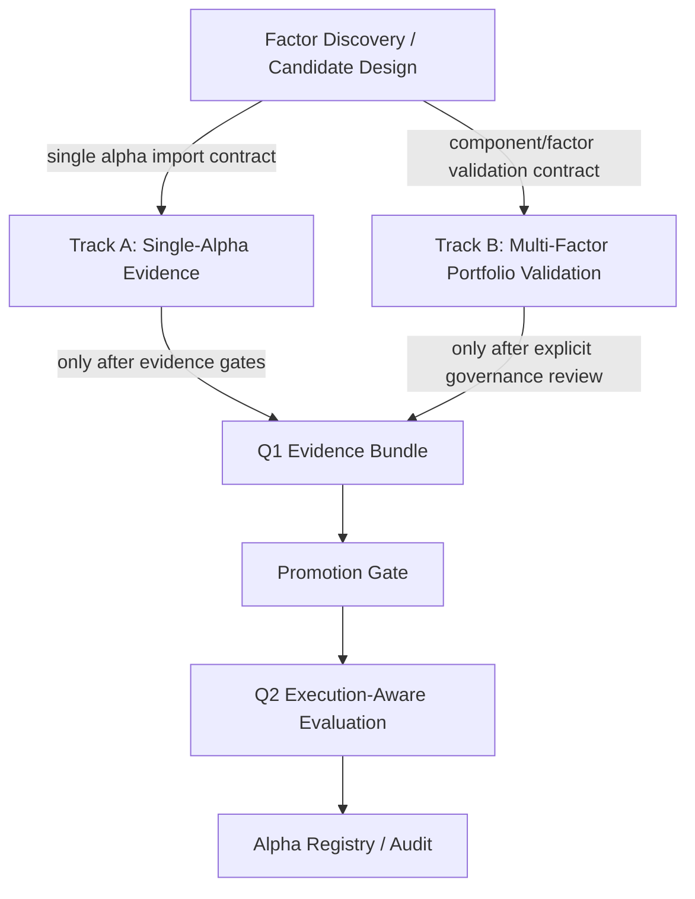

# Two-Track Research Architecture

PortfolioOS now separates research work into two tracks while keeping a shared
governance platform. This is a documentation and status-boundary layer only. It
does not move code, run Q2, promote candidates, approve paper/live workflows, or
create broker/order paths.

## Why Split

The active research lines answer different questions:

- Single-alpha research asks whether one candidate signal is real,
  timestamp-safe, and eligible for execution evaluation.
- Multi-factor portfolio validation asks whether a preregistered set of
  factors/components forms a robust diagnostic ensemble.

These should not be merged into one alpha story. Their evidence gates, failure
states, and next allowed work differ.

## What Stays Shared

The shared PortfolioOS governance platform owns:

- Q1 alpha triage contracts
- Evidence Bundle schemas
- Promotion Gate handoff contracts
- Q2 execution-aware evaluation
- Alpha Registry and audit reporting
- provenance, trace, validation, and forbidden-output guards

Shared governance can evaluate artifacts from either track, but candidate
generation and portfolio validation cannot bypass it.

## Track A: Single-Alpha Research Factory

Question:

```text
Is this individual alpha real, timestamp-safe, and eligible for execution evaluation?
```

This track owns candidate-level design and evidence work:

- SUE historical timestamp/evidence line
- revision-confirmed earnings underreaction candidate
- Factor Discovery Sandbox candidate-design work
- small-cap candidate-family design work
- typed AlphaView and event-alpha contracts

Current state:

- SUE is `blocked_timing`: WRDS IBES/Compustat timestamp sources were pulled,
  but no repairable earlier public-availability timestamp was found.
- Factor Discovery price-volume work is `factor_design_reset`: old failures are
  design constraints, not active alpha evidence.
- Revision-confirmed earnings underreaction is `insufficient_support`.
- Small-cap quality residual momentum is `rejected_capacity_or_placebo`.

Allowed next work:

- preregistered FactorDesignSpec work
- timestamp, coverage, placebo, and failure-mode planning
- exact timestamp import if a source is available
- Q1 evidence preparation only after design and evidence gates pass

Forbidden:

- direct Q2 entry
- Alpha Registry promotion
- production approval
- broker/order/live workflow
- treating old failed candidates as current alpha evidence

## Track B: Multi-Factor Portfolio Validation

Question:

```text
Can preregistered factors/components form a robust portfolio-level diagnostic ensemble?
```

This track owns portfolio/component-level validation:

- formal factor specs
- PIT signal panels
- risk exposure and residual attribution
- component roles
- ensemble OOS diagnostics
- portfolio assembly and ablation diagnostics

Current state:

- Formal Multi-Factor Alpha Validation is `diagnostic_component_pool`.
- Current ensemble/component artifacts are diagnostic only.
- The track does not produce direct Q2 inputs and does not claim production
  alpha.

Allowed next work:

- post-portfolio contribution diagnosis
- ablation analysis
- component OOS coverage refinement
- component role refinement

Forbidden:

- pretending portfolio diagnostics are single-alpha Q1 evidence
- direct Q2 entry
- security-level production construction
- broker/order/live workflow
- production approval language

## Candidate Movement Rules



Rules:

- Factor Discovery cannot enter Q2 directly.
- Track A cannot validate portfolio ensembles.
- Track B cannot claim single-alpha evidence unless a component is separately
  imported through Track A.
- Both tracks use shared governance only through typed contracts.
- Missing coverage remains explicit abstain/no_view, not zero alpha.

## Source Of Truth

The machine-readable registry is:

```text
configs/research_tracks.yaml
```

The schema and validator are:

```text
src/portfolio_os/research_tracks/status_schema.py
```

Validation:

```bash
make research-track-boundaries
```
